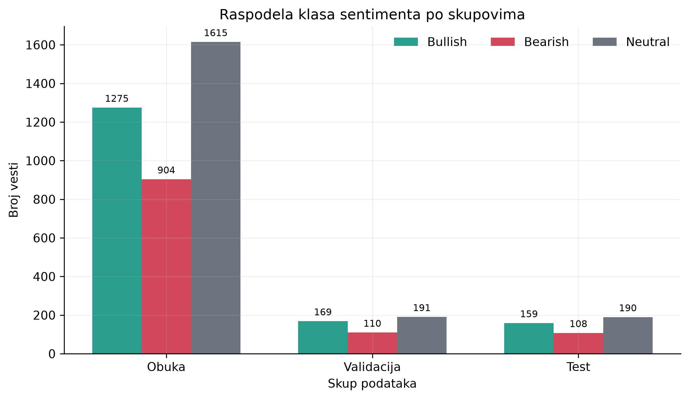
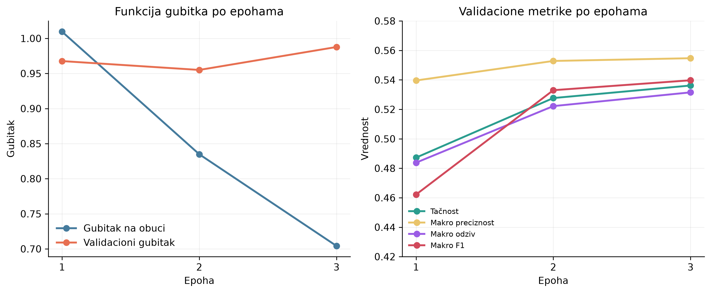
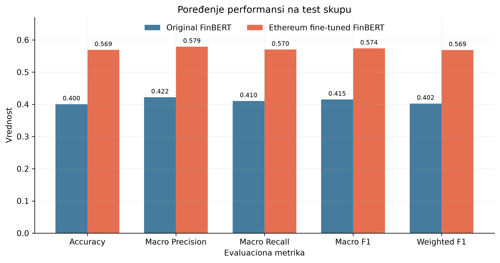
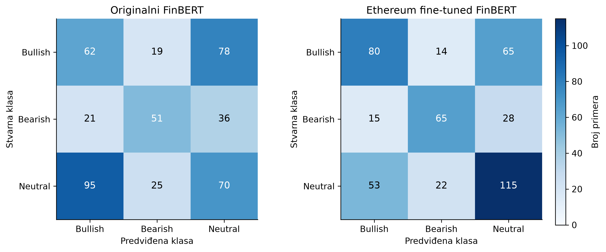

# Razvoj i višedimenzionalna klasifikacija vještačke inteligencije

## Sadržaj

1. [Uvod](#1-uvod)
2. [Nastanak i istorijski razvoj vještačke inteligencije](#2-nastanak-i-istorijski-razvoj-vještačke-inteligencije)
3. [Pojam i granice vještačke inteligencije](#3-pojam-i-granice-vještačke-inteligencije)
4. [Klasifikacija prema sposobnostima](#4-klasifikacija-prema-sposobnostima)
5. [Klasifikacija prema funkcionalnosti](#5-klasifikacija-prema-funkcionalnosti)
6. [Klasifikacija prema tehnikama i načinima učenja](#6-klasifikacija-prema-tehnikama-i-načinima-učenja)
7. [Klasifikacija prema ulozi u odlučivanju i stepenu autonomije](#7-klasifikacija-prema-ulozi-u-odlučivanju-i-stepenu-autonomije)
8. [Klasifikacija prema okruženju implementacije](#8-klasifikacija-prema-okruženju-implementacije)
9. [Povezivanje kriterijuma u višedimenzionalnu podjelu](#9-povezivanje-kriterijuma-u-višedimenzionalnu-podjelu)
10. [Zaključak prvog dijela](#10-zaključak-prvog-dijela)
11. [Uvod u praktični dio rada](#11-uvod-u-praktični-dio-rada)
12. [Reference](#12-reference)

## 1. Uvod

Vještačka inteligencija predstavlja jednu od najznačajnijih oblasti savremenog tehnološkog razvoja. Iako se o njoj danas govori kao o jedinstvenoj i prepoznatljivoj tehnologiji, vještačka inteligencija u stvarnosti obuhvata veliki broj različitih metoda, modela, sistema i oblasti primjene. Sistemi vještačke inteligencije mogu biti zasnovani na formalnoj logici i unaprijed definisanim pravilima, na statističkom učenju iz podataka, na neuronskim mrežama, na evolutivnim algoritmima ili na kombinaciji više različitih pristupa. Zbog toga izraz „vještačka inteligencija“ označava zapravo široku istraživačku i inženjersku oblast.

Razvoj ove oblasti odvijao se kroz više istorijskih etapa. Rani sistemi bili su uglavnom zasnovani na simboličkom predstavljanju znanja, logičkom zaključivanju i ručno definisanim pravilima. Kasniji razvoj mašinskog učenja pomjerio je težište sa eksplicitnog programiranja pravila na učenje obrazaca iz podataka. Napredak neuronskih mreža, dostupnost velikih skupova podataka i razvoj hardvera dodatno su ubrzali razvoj dubokog učenja. U novije vrijeme, transformer arhitekture, veliki jezički modeli i generativna vještačka inteligencija proširili su mogućnosti sistema za obradu jezika, slike, zvuka i drugih oblika podataka.

Pojmovi vještačka inteligencija, mašinsko učenje, duboko učenje i generativna vještačka inteligencija često se koriste zajedno, iako označavaju različite nivoe ili aspekte iste oblasti. Vještačka inteligencija predstavlja najširi pojam. Mašinsko učenje odnosi se na metode koje omogućavaju sistemu da na osnovu podataka nauči obrasce potrebne za donošenje predikcija ili odluka. Duboko učenje predstavlja podskup mašinskog učenja koji se oslanja na višeslojne neuronske mreže. Generativna vještačka inteligencija označava sisteme koji, na osnovu naučenih obrazaca, mogu da stvaraju novi tekst, slike, zvuk, programski kod ili druge vrste sadržaja.

Pored razlika u tehnikama, sistemi vještačke inteligencije razlikuju se i prema svojim sposobnostima, funkcionalnosti, svrsi i načinu implementacije. Jedan sistem može biti specijalizovan za samo jedan zadatak, dok drugi može podržavati veliki broj različitih zadataka. Neki sistemi reaguju samo na trenutno stanje, dok drugi koriste podatke iz prethodnih interakcija ili istorijskih zapisa. Takođe, vještačka inteligencija može služiti kao alat za podršku čovjeku ili može preuzeti određeni stepen autonomnog izvršavanja zadataka.

U ovom radu vještačka inteligencija posmatra se kroz nekoliko osnovnih kriterijuma: sposobnosti, funkcionalnost, tehnički pristup, ulogu u odlučivanju, stepen autonomije i okruženje implementacije. Ovakva podjela nije preuzeta kao jedinstvena taksonomija iz jednog izvora, već predstavlja autorsku sintezu pristupa iz literature. Svaki kriterijum odgovara na drugo pitanje: sposobnosti opisuju širinu zadataka, funkcionalnost način korištenja informacija, tehnički pristup arhitekturu i način na koji model uči, dok uloga, autonomija i okruženje određuju način primjene modela u sistemu. Kombinovanjem ovih kriterijuma može se precizno opisati model za analizu sentimenta iz praktičnog dijela rada.
Prvi dio rada obuhvata kratak istorijski pregled razvoja vještačke inteligencije, od simboličkih i ekspertnih sistema do mašinskog učenja, dubokog učenja i savremenih jezičkih modela. Posebna pažnja posvećena je važnim modelima i arhitekturama, kao što su perceptron, neuronske mreže, AlexNet i Transformer. Teorijski okvir na kraju priprema osnovu za praktični dio rada.

## 2. Nastanak i istorijski razvoj vještačke inteligencije

### 2.1 Teorijske osnove

Teorijske osnove vještačke inteligencije formirale su se sredinom dvadesetog vijeka, u periodu razvoja prvih elektronskih računara i formalnih metoda za opisivanje računanja. Jedan od najvažnijih doprinosa dao je Alan Turing u radu *Computing Machinery and Intelligence* iz 1950. godine (Turing, 1950). Umjesto da pokušava da ponudi strogu definiciju mišljenja, Turing predlaže praktičan test zasnovan na ponašanju: ispitivač vodi tekstualni razgovor i sa čovjekom i sa mašinom, ne znajući ko je ko. Ako mašina uspije da navede ispitivača da povjeruje da razgovara sa čovjekom, smatra se da pokazuje inteligentno ponašanje.

Ovaj prijedlog poznat je kao Turingov test, odnosno igra imitacije. U osnovnoj postavci, ispitivač komunicira sa čovjekom i mašinom bez direktnog uvida u njihov identitet, a zatim pokušava da utvrdi ko je dao koji odgovor. Turingov test nije zamišljen kao potpuna mjera inteligencije niti kao dokaz da mašina posjeduje ljudsku svijest. Njegov istorijski značaj ogleda se u tome što je otvorio mogućnost da se inteligentno ponašanje proučava preko mjerljivih rezultata.

Drugi važan trenutak predstavlja prijedlog za Dartmautsku ljetnju istraživačku radionicu iz 1955. godine, koju su pripremili John McCarthy, Marvin Minsky, Nathaniel Rochester i Claude Shannon. Radionica je održana 1956. godine i često se navodi kao događaj kojim je vještačka inteligencija oblikovana kao posebna istraživačka oblast. U prijedlogu je iznesena pretpostavka da se svaki aspekt učenja ili drugi oblik inteligencije može, barem u načelu, dovoljno precizno opisati tako da ga mašina može simulirati. Ova pretpostavka usmjerila je rane istraživače prema problemima kao što su zaključivanje, korišćenje jezika rješavanje problema, i učenje.

Rani pristup vještačkoj inteligenciji bio je snažno povezan sa matematikom, logikom i teorijom računanja. Istraživači su polazili od ideje da se složeno ponašanje može predstaviti pomoću simbola, pravila i postupaka za njihovo kombinovanje. Ako se znanje može zapisati formalnim jezikom, a postupak zaključivanja izraziti kao niz jasno definisanih operacija, računar može izvršavati takve postupke i rješavati probleme koji se povezuju sa inteligentnim ponašanjem. Ovakvo razmišljanje kasnije je dovelo do razvoja simboličke vještačke inteligencije i ekspertnih sistema.

U ovoj ranoj fazi očekivanja su bila veoma velika. Vjerovalo se da bi, uz dovoljno precizno predstavljanje znanja i odgovarajuće algoritme, računari mogli da rješavaju širok raspon problema. Ipak, kasniji razvoj pokazao je da formalizovanje svakodnevnog znanja, neizvjesnosti i konteksta predstavlja mnogo složeniji zadatak nego što se prvobitno pretpostavljalo. Zbog toga su teorijske osnove iz ovog perioda važne i kao početak razvoja AI i kao osnova za razumijevanje ograničenja ranih simboličkih sistema. Sledeće poglavlje detaljnije razmatra upravo taj simbolički period.

### 2.2 Simbolički period

Simbolička vještačka inteligencija predstavlja jedan od prvih dominantnih pristupa u razvoju ove oblasti. Njena osnovna pretpostavka jeste da se znanje i postupci zaključivanja mogu predstaviti pomoću simbola, pravila i formalnih jezika. Za razliku od savremenih modela koji obrasce najčešće uče iz velikih skupova podataka, simbolički sistemi se oslanjaju na eksplicitno zapisano znanje i unaprijed definisana pravila.

U simboličkim sistemima znanje se obično čuva u obliku činjenica, odnosa i pravila. Pravila mogu imati oblik uslovnih iskaza, na primjer: ako su ispunjeni određeni uslovi, onda treba izvesti određeni zaključak. Poseban dio sistema, poznat kao mehanizam zaključivanja, primjenjuje ta pravila na dostupne činjenice. Na taj način sistem može da pretražuje moguće zaključke, rješava logičke probleme ili predlaže odluke u ograničenom domenu.

Jedan od ranih i istorijski značajnih primjera jeste Logični Teorista (Logic Theorist), razvijen sredinom 1950-ih godina. Ovaj program su razvili Allen Newell, Herbert A. Simon i Cliff Shaw sa ciljem da demonstriraju da računar može da izvršava postupke slične ljudskom logičkom zaključivanju. Program je bio namijenjen dokazivanju matematičkih teorema i koristio je simboličko predstavljanje problema i pretraživanje mogućih koraka ka rješenju. Njegov značaj nije samo u konkretnim dokazima, već i u ideji da se rješavanje problema može opisati kao postupak pretrage i manipulisanja simbolima.

Kasniji razvoj doveo je do ekspertnih sistema, koji su pokušavali da znanje stručnjaka prenesu u računarski program. Ekspertni sistem obično se sastojao od baze znanja i mehanizma zaključivanja. Baza znanja sadržala je činjenice i pravila iz određene oblasti, dok je mehanizam zaključivanja koristio ta pravila za izvođenje zaključaka na osnovu podataka koje je korisnik unosio. Ovakva struktura omogućila je da sistem u ograničenom domenu daje preporuke i objašnjenja nalik postupku ljudskog stručnjaka.

Poznat primjer je MYCIN, ekspertni sistem razvijen na Univerzitetu Stanford tokom 1970-ih godina. MYCIN je bio namijenjen podršci pri prepoznavanju određenih bakterijskih infekcija i izboru odgovarajuće antibiotske terapije. Sistem je koristio skup medicinskih pravila, a pri donošenju zaključaka uzimao je u obzir i stepen sigurnosti pojedinih procjena. Iako nije bio zamišljen kao zamjena za ljekara, MYCIN je pokazao da simbolički sistem može da objedini znanje iz uske oblasti i da svoje zaključke predstavi kroz niz razumljivih pravila.

Najveća prednost simboličke vještačke inteligencije bila je mogućnost relativno jasnog praćenja procesa zaključivanja. Kada sistem donese zaključak, korisnik može da vidi koja su pravila primijenjena i na kojim činjenicama se zaključak zasniva. To je posebno značajno u oblastima u kojima je potrebno obrazložiti odluku. Simbolički sistemi takođe mogu dobro funkcionisati kada je domen jasno definisan, a znanje može precizno da se izrazi pravilima.

Kao jedan od najpoznatijih uspjeha simboličke vještačke inteligencije izdvaja se IBM-ov sistem Deep Blue, koji je 1997. godine pobijedio svjetskog šampiona u šahu Garija Kasparova, koristeći unaprijed definisana pravila, procjenu pozicija i sistematsko pretraživanje velikog broja mogućih poteza.

Ipak, ovaj pristup ima ozbiljna ograničenja. Ručno prikupljanje i zapisivanje znanja zahtijeva mnogo vremena i zavisi od dostupnosti stručnjaka. Pravila mogu postati veoma brojna i međusobno složena, pa njihovo održavanje postaje teško. Simbolički sistemi takođe imaju poteškoće sa nepotpunim, nejasnim i kontradiktornim informacijama, kao i sa situacijama koje nisu unaprijed predviđene. Zbog toga su rani sistemi često bili uspješni u uskim oblastima, ali nisu mogli lako da se prilagode novim problemima ili da znanje prenesu u drugi domen.

Uprkos tim ograničenjima, simbolički pristup postavio je važne temelje za razvoj ekspertnih sistema, obrade znanja, planiranja i automatskog zaključivanja. Kasniji razvoj mašinskog učenja ponudio je drugačiji način izgradnje sistema: umjesto da se sva pravila ručno zadaju, model uči obrasce iz podataka.

### 2.3 AI zime i promjena istraživačkog pravca

Razvoj vještačke inteligencije nije tekao ravnomjerno tokom proteklih sedamdesetak godina. Periodi velikog optimizma i visokih očekivanja smjenjivali su se sa periodima razočaranja, smanjenog finansiranja i samim tim slabijeg interesovanja istraživačke zajednice. Takvi periodi poznati su kao AI zime. Od istraživanja se nije potpuno odustalo, već se njihov intenzitet smanjivao.

Jedan od glavnih uzroka prvih problema bio je nesklad između očekivanja i tadašnjih tehničkih mogućnosti. Rani programi vještačke inteligencije uspješno su rješavali pojednostavljene probleme u ograničenim uslovima, ali su se teško snalazili kada je trebalo obraditi složenije i nepredvidive situacije. Sistemi koji su radili sa malim skupom pravila nisu mogli lako da se prilagode novim primjerima, nepotpunim informacijama i promjenama u okruženju.

Tokom 1970-ih godina postalo je jasno da ograničena računarska snaga predstavlja ozbiljnu prepreku za razvoj složenijih sistema. Osim što su računari bili slabiji, velike baze podataka potrebne za razvoj AI sistema uglavnom nisu bile dostupne u obliku pogodnom za automatsku obradu. Ovakva ograničenja doprinijela su smanjenju finansiranja i nastanku prve AI zime.

Drugi talas razočaranja uslijedio je tokom kasnih 1980-ih i početkom 1990-ih. U tom periodu, velika pažnja bila je posvećena ekspertnim sistemima, koji su znanje prikazivali kroz veliki broj ručno definisanih pravila. Iako su takvi sistemi mogli da daju korisne rezultate u usko određenim oblastima, njihovo razvijanje i održavanje bilo je skupo. Svaka promjena u oblasti zahtijevala je dodatno prikupljanje znanja i ručno prilagođavanje pravila. Pored toga, sistemi su se teško nosili sa kontradiktornim podacima i situacijama koje nisu bile predviđene prilikom njihovog projektovanja.

Iskustvo sa AI zimama pokazalo je da sama složenost pravila nije dovoljna za izgradnju inteligentnog sistema. Problem nije bio samo u broju pravila, već i u tome što je bilo teško unaprijed opisati sve okolnosti u kojima će projektovani sistem raditi. Zbog toga se istraživački interes postepeno pomjerao ka metodama koje mogu da uče iz primjera. Umjesto da programer ručno definiše svaku vezu između ulaza i izlaza, model pokušava da pronađe pravilnosti u dostupnim podacima.

Ovaj zaokret predstavlja osnovu statističkog mašinskog učenja. U takvom pristupu model se obučava na skupu podataka i na osnovu njega podešava svoje parametre. Kvalitet sistema zato zavisi od količine, strukture i pouzdanosti podataka, ali i od izabrane metode učenja. Statistički modeli nisu uklonili potrebu za ljudskim znanjem, ali su omogućili da se dio znanja izgradi automatski, kroz obradu većeg broja primjera.

Promjena istraživačkog pravca postala je naročito značajna kada su istovremeno napredovali računarski hardver, prikupljanje podataka i algoritmi mašinskog učenja. Time su stvoreni uslovi za uspješniju primjenu neuronskih mreža i razvoj dubokog učenja. Naredna etapa obuhvata perceptron, algoritam povratnog prostiranja greške, korišćenje grafičkih procesora i modele koji su pokazali da se složene reprezentacije mogu naučiti direktno iz podataka.

### 2.4 Uspon mašinskog i dubokog učenja

Prelazak sa ručno definisanih pravila na učenje iz podataka doveo je do ponovnog razvoja neuronskih mreža. Neuronska mreža sastoji se od međusobno povezanih jedinica koje obrađuju ulazne podatke i postepeno formiraju složenije reprezentacije. Tokom obučavanja, parametri mreže mijenjaju se tako da se smanjuje razlika između predviđenog i željenog izlaza. Na taj način model može da nauči pravilnosti koje nisu unaprijed zapisane u obliku eksplicitnih pravila.

Jedan od prvih značajnih modela ove vrste bio je perceptron, koji je krajem 1950-ih predstavljen kao jednostavan model za klasifikaciju. Perceptron prima više ulaznih vrijednosti, dodjeljuje im težine i na osnovu njihove kombinacije donosi odluku o pripadnosti određenoj klasi. Iako je imao ograničene mogućnosti i nije mogao da riješi sve vrste problema, perceptron je pokazao da se određeni elementi odlučivanja mogu naučiti iz primjera. Njegov značaj je zato veći od neposredne praktične primjene, jer je poslužio kao osnova za kasnije složenije neuronske mreže.

Važan korak u razvoju višeslojnih neuronskih mreža predstavlja algoritam povratnog prostiranja greške. Ovaj algoritam omogućava da se greška izračunata na izlazu mreže prenese unazad kroz njene slojeve. Na osnovu te greške podešavaju se težine veza između neurona, čime se mreža postepeno poboljšava. Povratno prostiranje greške učinilo je obučavanje višeslojnih mreža praktičnijim i omogućilo im da uče složenije odnose između ulaznih podataka i izlaznih rezultata.

Šira primjena dubokog učenja postala je moguća tek kada su se istovremeno razvili hardver, metode obučavanja i dostupnost podataka. Grafičke procesorske jedinice, poznate kao GPU, mogu paralelno da izvršavaju veliki broj sličnih matematičkih operacija. To ih čini pogodnim za obučavanje neuronskih mreža, koje tokom rada zahtijevaju veliki broj operacija nad matricama. Pored toga, digitalizacija sadržaja i razvoj internet servisa omogućili su formiranje velikih skupova podataka za obučavanje i provjeru modela.

Jedna od najpoznatijih prekretnica dogodila se 2012. godine, kada je model AlexNet ostvario veoma dobre rezultate u klasifikaciji slika. Model je koristio duboku konvolucionu neuronsku mrežu i bio obučavan na velikom skupu označenih slika uz pomoć GPU računanja. Njegov uspjeh pokazao je da kombinacija velikog broja podataka, odgovarajuće arhitekture i dovoljno snažnog hardvera može značajno da poboljša rezultate u kompjuterskom vidu. AlexNet je zato doprinio široj prihvaćenosti dubokog učenja u istraživanju i industriji.

Dalji razvoj doveo je do arhitekture transformer, predstavljene 2017. godine. Za razliku od ranijih sekvencijalnih modela, transformer koristi mehanizam pažnje kako bi procijenio odnose između različitih dijelova ulazne sekvence. Ovaj pristup omogućava efikasniju obradu dugih tekstova i bolje povezivanje riječi koje su međusobno udaljene u rečenici. Zahvaljujući tome, transformer je postao osnova za razvoj savremenih jezičkih modela.

Razvoj od perceptrona do transformera pokazuje promjenu u načinu izgradnje sistema vještačke inteligencije. Dok su rani modeli imali ograničenu sposobnost predstavljanja složenih odnosa, savremene arhitekture mogu da uče višeslojne reprezentacije iz velikih količina podataka.

## 3. Pojam i granice vještačke inteligencije

### 3.1 Problem jedinstvene definicije

Vještačka inteligencija nema jednu definiciju koja obuhvata sve pristupe, metode i sisteme razvijene u ovoj oblasti. Pojam inteligencije može se povezati sa oponašanjem ljudskog ponašanja, pravilnim zaključivanjem, učenjem iz iskustva ili uspješnim ostvarivanjem cilja. Zbog toga izbor definicije utiče na to koji sistemi se klasifikuju kao vještačka inteligencija.

Klasični pristupi razlikuju sisteme koji misle kao ljudi i sisteme koji djeluju kao ljudi. Prvi pristup usmjeren je na oponašanje ljudskih kognitivnih procesa, kao što su učenje, pamćenje i zaključivanje. Kod drugog pristupa nije presudno kako sistem dolazi do rezultata, već da li se njegovo ponašanje može uporediti sa ljudskim. Turingov test predstavlja najpoznatiji primjer takvog pristupa, jer procjenjuje da li čovjek može da razlikuje mašinu od drugog čovjeka tokom tekstualne komunikacije.

Druga dva pristupa polaze od racionalnosti. Sistemi koji misle racionalno koriste formalna pravila logike kako bi iz poznatih činjenica izveli ispravne zaključke. Ovaj pristup bio je posebno važan za razvoj simboličke AI. Sistemi koji djeluju racionalno biraju postupak koji, na osnovu dostupnih informacija, najviše doprinosi ostvarivanju postavljenog cilja. Takvo određenje pogodnije je za procjenu savremenih sistema, jer se njihova uspješnost može mjeriti prema ostvarenim rezultatima.

### 3.2 Odnos AI, mašinskog učenja i dubokog učenja

Vještačka inteligencija predstavlja najširu oblast i obuhvata različite metode za izgradnju sistema koji mogu da izvršavaju zadatke povezane sa ljudskim sposobnostima, kao što su zaključivanje, učenje, razumijevanje jezika i donošenje odluka. Ova oblast obuhvata i simboličke sisteme zasnovane na pravilima i savremene modele koji uče iz velikih količina podataka.

Mašinsko učenje je dio vještačke inteligencije koji se zasniva na učenju obrazaca iz podataka. Umjesto da se sva pravila unaprijed zadaju, model se obučava na primjerima i podešava svoje parametre na osnovu greške u predviđanju. Mašinsko učenje obuhvata različite pristupe, uključujući nadgledano, nenadgledano i učenje putem nagrađivanja.

Duboko učenje predstavlja uži dio mašinskog učenja. Ono koristi višeslojne neuronske mreže koje mogu da uče složene reprezentacije podataka. Dublji slojevi mreže omogućavaju postepenu obradu informacija, od jednostavnijih osobina do složenijih obrazaca. Ovakav pristup posebno je značajan u obradi slika, govora i prirodnog jezika.

Generativni modeli su modeli koji, na osnovu naučenih obrazaca, stvaraju novi sadržaj. Taj sadržaj može biti tekst, slika, zvuk ili druga vrsta podataka. Iako se savremeni generativni modeli uglavnom zasnivaju na dubokom učenju, nije svaki model dubokog učenja generativan. Razlika između generativnih i diskriminativnih modela zavisi od cilja obuke i vrste izlaza koji model proizvodi.

Ovaj odnos može se predstaviti kao hijerarhija: mašinsko učenje je dio vještačke inteligencije, duboko učenje je dio mašinskog učenja, a generativni modeli predstavljaju posebnu grupu modela koja se može zasnivati na dubokom učenju. Razlikovanje ovih pojmova važno je za precizan opis modela i njegovih mogućnosti, posebno kada se analiziraju arhitektura, način obučavanja i namjena sistema.

### 3.3 AI sistem, model i aplikacija

Model je matematička i računarska komponenta koja na osnovu ulaznih podataka daje određeni izlaz. On sadrži parametre naučene tokom obučavanja, ali sam po sebi ne mora obuhvatati podatke, način pripreme ulaza ili korisnički interfejs. U slučaju modela za klasifikaciju teksta, model predstavlja neuronsku mrežu obučenu za obradu tekstualnih podataka i predviđanje pripadajuće klase sentimenta.

AI sistem je šira cjelina koja, pored modela, može obuhvatati skup podataka, postupke čišćenja i pretprocesiranja, pravila za obradu rezultata, infrastrukturu i način komunikacije sa korisnikom. Na primjer, sistem za analizu sentimenta finansijskih vijesti može sadržati učitavanje vijesti, pretprocesiranje teksta, izvršavanje predviđanja i prikaz dobijene klase.

Aplikacija predstavlja praktičnu upotrebu jednog ili više AI sistema za ostvarivanje konkretnog cilja. Aplikacija može biti program, veb servis ili istraživačka skripta koja korisniku omogućava da unese tekst i dobije procjenu sentimenta. U tom slučaju klasifikacioni model je jedna komponenta, postupak obrade i predviđanja čini AI sistem, a alat za analizu finansijskih vijesti predstavlja aplikaciju.

Razlikovanje ova tri pojma važno je za precizan opis rada. Rezultat modela ne zavisi samo od njegove arhitekture, već i od podataka, pretprocesiranja, načina obučavanja i uslova u kojima se koristi.

## 4. Klasifikacija prema sposobnostima

### 4.1 Uska vještačka inteligencija – ANI

Uska vještačka inteligencija, koja se u literaturi često označava skraćenicom ANI (Artificial Narrow Intelligence), predstavlja kategoriju sistema projektovanih za izvršavanje jednog zadatka ili ograničenog skupa međusobno povezanih zadataka. Takav sistem može ostvarivati veoma dobre rezultate u jasno određenom domenu, ali njegovo znanje i sposobnosti nisu opšteg karaktera. Model koji je obučen za klasifikaciju slika, na primjer, ne može se bez dodatne obuke koristiti za razumijevanje finansijskih vijesti. Ograničenje nije nužno posljedica slabih performansi, već činjenice da je sistem optimizovan za određeni problem i određenu vrstu ulaznih podataka.

Većina današnjih praktičnih AI sistema pripada ovoj kategoriji. Sistemi za preporuku procjenjuju koje bi proizvode, filmove ili vijesti korisnik mogao izabrati. Sistemi za prepoznavanje slika klasifikuju objekte ili otkrivaju određene obrasce u vizuelnim podacima. Glasovni asistenti pretvaraju govor u tekst, prepoznaju namjeru korisnika i izvršavaju ograničene komande. Modeli za analizu sentimenta procjenjuju emocionalnu ili tržišnu orijentaciju tekstualnog sadržaja. Svi ovi sistemi mogu biti složeni i zasnovani na naprednim algoritmima, ali su njihove sposobnosti i dalje vezane za konkretan zadatak.

Važna osobina ANI sistema jeste ograničena prenosivost naučenog znanja. Model može naučiti veoma složene pravilnosti u skupu podataka, ali to ne znači da razumije te pravilnosti na način koji bi mu omogućio pouzdano riješavanje novih problema. 

Uska AI može biti veoma korisna upravo zato što je ograničena. Jasno definisan cilj omogućava izbor odgovarajućih podataka, metrike i uslova testiranja. 

### 4.2 Opšta vještačka inteligencija – AGI

Opšta vještačka inteligencija, odnosno AGI (Artificial General Intelligence), označava hipotetički tip sistema koji bi mogao da uči, zaključuje i prenosi znanje između širokog skupa različitih zadataka. Za razliku od ANI sistema, AGI ne bi bio ograničen na jedan domen, već bi trebalo da se prilagođava novim problemima bez posebnog projektovanja za svaki pojedinačni zadatak. U idealizovanom smislu, takav sistem mogao bi da uči iz iskustva, planira, rješava probleme, razumije jezik i primjenjuje ranije stečeno znanje u novim situacijama.

Pojam AGI nije isto što i sistem koji izvršava veliki broj unaprijed određenih zadataka. Širok interfejs ili mogućnost korišćenja više alata ne predstavljaju sami po sebi dokaz opšte inteligencije. Za procjenu AGI bilo bi potrebno razmotriti sposobnost sistema da pouzdano rješava nove probleme, da uči sa relativno malo podataka, da prenosi znanje između domena i da se prilagođava promjenljivim uslovima. Takvi kriterijumi su složeni, a među istraživačima ne postoji potpuna saglasnost o tome kako bi se opšta inteligencija mjerila.

AGI se zato može posmatrati kao istraživački cilj i teorijska kategorija, a ne kao jasno identifikovan tip proizvoda. Savremeni veliki jezički modeli pokazuju izuzetnu širinu u obradi različitih zadataka, ali njihova uspješnost može značajno zavisiti od formulacije upita, dostupnosti konteksta, kvaliteta podataka i dodatnih komponenti sistema. Sposobnost generisanja uvjerljivog teksta ne znači automatski da sistem posjeduje stabilan model svijeta, pouzdano rasuđivanje ili opštu sposobnost učenja.

AGI se često javlja kao bliska ili već ostvarena tehnologija, ali ne postoji opšteprihvaćen kriterijum na osnovu kojeg bi se moglo zaključiti da je takav sistem razvijen. Zbog toga se u ovoj klasifikaciji AGI navodi kao koncept koji pokazuje granicu između današnjih specijalizovanih sistema i zamišljenog sistema široke inteligencije.

### 4.3 Superinteligencija – ASI

Superinteligencija, odnosno ASI (Artificial Superintelligence), predstavlja još širi i apstraktniji koncept. Njime se označava hipotetički sistem koji bi u velikom broju kognitivnih oblasti nadmašivao ljudske sposobnosti. To bi moglo uključivati učenje, naučno zaključivanje, planiranje, jezičku komunikaciju, kreativno rješavanje problema i donošenje odluka. Za razliku od AGI, koji se najčešće definiše kroz približavanje opštem nivou ljudske inteligencije, ASI podrazumijeva nadmašivanje ljudi u relevantnim intelektualnim zadacima.

ASI nije postojeća tehnička kategorija koju je moguće analizirati na isti način kao klasifikator, neuronsku mrežu ili ekspertni sistem. Ne postoji standardizovan model superinteligencije niti skup empirijskih testova koji bi omogućili njeno neposredno mjerenje. Zbog toga se ASI uglavnom razmatra u okviru filozofije tehnologije, predviđanja budućeg razvoja, bezbjednosti AI sistema i etike. U tim raspravama pažnja se usmjerava na moguće posljedice sistema koji bi imao široke sposobnosti i mogao samostalno da unapređuje svoje metode ili utiče na kompleksna okruženja.

Prilikom obrade ASI treba izbjeći izjednačavanje sa savremenim modelima koji pokazuju visoke rezultate na pojedinačnim testovima. Nadmašivanje čovjeka u šahu, prepoznavanju objekata ili generisanju teksta predstavlja uspjeh u konkretnom zadatku, ali nije dokaz superinteligencije. ASI podrazumijeva široku i stabilnu nadmoć kroz veliki broj različitih kognitivnih sposobnosti, što za sada ostaje teorijska pretpostavka.

### 4.4 Ograničenja ove podjele

Podjela na ANI, AGI i ASI korisna je za objašnjenje različitih nivoa opštosti, ali ima važna ograničenja. Prvo, granica podjele nije precizno određena. 

Drugo, ova podjela miješa postojeće sisteme sa hipotetičkim razvojnim stadijumima. ANI se odnosi na realne i široko rasprostranjene sisteme, dok su AGI i ASI koncepti čije ostvarenje i kriterijumi procjene nisu opšteprihvaćeni. Zbog toga kategorije ne treba tumačiti kao preciznu vremensku liniju razvoja. One više služe kao konceptualni okvir za razlikovanje specijalizovane funkcionalnosti od opštih i hipotetičkih sposobnosti.

Treće, nivo sposobnosti ne govori ništa dovoljno precizno o načinu na koji je sistem napravljen. Dva sistema mogu biti uska AI, a da jedan bude simbolički ekspertni sistem, dok drugi koristi duboku neuronsku mrežu. Obrnuto, isti tehnički pristup može biti upotrijebljen u različitim aplikacijama i za različite nivoe autonomije. Zato klasifikaciju prema sposobnostima treba kombinovati sa klasifikacijama prema funkcionalnosti, tehnikama, svrsi i načinu implementacije.

Na kraju, termin „inteligencija“ u ovoj podjeli može dovesti do različitih tumačenja. Visoke performanse na testu ili sposobnost proizvodnje uvjerljivog odgovora ne dokazuju svijest, razumijevanje ili ljudski način mišljenja. Precizniji opis uvijek treba da navede zadatak, podatke, metriku i uslove u kojima je sistem procijenjen.

## 5. Klasifikacija prema funkcionalnosti

### 5.1 Reaktivne mašine

Klasifikacija prema funkcionalnosti posmatra način na koji AI sistem obrađuje informacije i koristi podatke tokom izvršavanja zadataka. Ova podjela je korisna za opis ponašanja sistema, ali ne treba da se miješa sa klasifikacijom prema tehnikama. Dva sistema mogu koristiti različite tehnike, a ipak pokazivati sličan funkcionalni obrazac.

Reaktivne mašine predstavljaju najjednostavniji oblik funkcionalnosti. One reaguju na trenutno stanje ulaza i na osnovu njega proizvode izlaz, bez trajnog korišćenja prethodnih iskustava. Sistem nema memoriju u smislu da bi ranije posmatrane situacije mijenjale njegove buduće odluke. Njegovo ponašanje određeno je trenutnim ulazom, pravilima, funkcijom procjene ili drugim postupkom koji je ugrađen u sistem.

Kao istorijski primjer često se navodi IBM Deep Blue, šahovski sistem koji je 1997. godine pobijedio svjetskog šampiona Garija Kasparova. Deep Blue je procjenjivao šahovske pozicije i pretraživao moguće nastavke partije, ali njegov uspjeh nije zavisio od ljudskog razumijevanja šaha niti od trajnog pamćenja prethodnih partija. Sistem je bio projektovan za izuzetno složen, ali jasno ograničen zadatak. Ovaj primjer pokazuje da reaktivna funkcionalnost može dovesti do veoma visokih performansi u određenom domenu.

Pri tumačenju ovog primjera važno je razlikovati složenost obrade od funkcionalne širine. Sistem može analizirati veliki broj mogućih poteza i koristiti zahtjevne algoritme pretraživanja, a da pri tome i dalje nema opšti model svijeta, sposobnost učenja iz proizvoljnih iskustava ili razumijevanje namjera protivnika. Zbog toga uspjeh u šahu ne predstavlja dokaz opšte inteligencije.

### 5.2 Sistemi ograničene memorije

Sistemi ograničene memorije koriste podatke iz prošlosti pri donošenju odluke u sadašnjem trenutku. Za razliku od reaktivnih mašina, ne zavise isključivo od trenutnog ulaza. Njihova memorija je ipak ograničena: stanje se čuva samo tokom određenog vremenskog perioda ili za unaprijed definisanu svrhu, a ne predstavlja trajno i opšte razumijevanje svijeta.

Za dosljednu upotrebu ove kategorije potrebno je razlikovati tri pojma. Naučeni parametri predstavljaju znanje stečeno tokom obuke, ali se pri svakoj pojedinačnoj obradi ne mijenjaju na osnovu novog ulaza. Trenutni ulazni kontekst obuhvata podatke koje model vidi u jednoj obradi, na primjer riječi iste vijesti. Memorijom se u ovom radu smatra stanje ili istorija koja se zadržava između odvojenih obrada i koristi pri kasnijim odlukama, na primjer istorija interakcija korisnika ili niz nedavnih senzorskih opažanja.

Autonomna vozila predstavljaju primjer sistema koji pri donošenju odluka koriste podatke prikupljene u prethodnim kratkim vremenskim intervalima. Podaci sa senzora mogu pomoći u procjeni kretanja drugih vozila, pješaka i prepreka. Slično tome, sistemi za preporuku mogu koristiti istoriju ranijih interakcija kako bi prilagodili narednu preporuku korisniku. Jezički model za klasifikaciju teksta može koristiti kontekst jednog ulaza i fiksne naučene parametre, ali ne mora čuvati stanje između dvije nezavisne klasifikacije. Takav model zato sam po sebi nije sistem ograničene memorije; to bi mogao biti širi sistem u koji je model ugrađen, ako taj sistem čuva i koristi istorijske podatke.

### 5.3 Teorija uma

Teorija uma označava hipotetičku funkcionalnu sposobnost sistema da modeluje mentalna stanja drugih agenata. To bi uključivalo razumijevanje njihovih uvjerenja, namjera, znanja, očekivanja i emocija, kao i procjenu načina na koji ta stanja utiču na ponašanje. Kod ljudi se teorija uma povezuje sa sposobnošću da shvate da druga osoba može imati informacije ili uvjerenja koja se razlikuju od njihovih sopstvenih.

AI sistem sa razvijenom teorijom uma trebalo bi da razlikuje ono što je objektivno tačno od onoga što drugi agent vjeruje da je tačno. Takođe bi trebalo da predviđa ponašanje na osnovu ciljeva i ograničenih informacija tog agenta. Ova sposobnost bila bi značajna za saradnju čovjeka i mašine, pregovaranje, socijalnu robotiku i sisteme koji rade u dinamičnim okruženjima sa više učesnika.

Savremeni sistemi mogu prepoznavati obrasce povezane sa emocijama, sarkazmom ili perspektivom govornika. Međutim, takva uspješnost ne predstavlja dovoljan dokaz stvarnog razumijevanja mentalnih stanja. Model može naučiti statističku vezu između određenih izraza i oznake emocije, bez posjedovanja stabilnog koncepta osobe, njenih uvjerenja i razloga za ponašanje. Zbog toga treba razlikovati funkcionalno prepoznavanje jezičkih obrazaca od opšte i pouzdane teorije uma.

U Duttinoj taksonomiji teorija uma pripada hipotetičkim ili budućim kategorijama (Dutta, 2025). Njena vrijednost u taksonomiji nije u tome što opisuje široko dostupne proizvode, već u tome što pokazuje kakav bi stepen funkcionalne složenosti bio potreban za interakciju koja bi se približila ljudskom socijalnom razumijevanju.

### 5.4 Samosvjesna AI

Samosvjesna vještačka inteligencija predstavlja hipotetički sistem koji bi posjedovao svijest o sopstvenom postojanju, stanju i granicama. U širem smislu, takav sistem bi morao imati unutrašnju reprezentaciju sebe, razlikovati sebe od okruženja i na neki način imati subjektivno iskustvo. Ovi zahtjevi nisu samo tehnički, već zadiru i u filozofska pitanja o prirodi svijesti i iskustva.

Za sada ne postoje opšteprihvaćeni dokazi da je razvijen AI sistem koji je samosvjestan. Jezička sposobnost, uvjerljiv razgovor ili korišćenje riječi „ja“ u rečenici ne predstavljaju dokaz subjektivne svijesti. Model može generisati iskaze o sebi zato što je naučen obrascima jezika i zato što je takav odgovor vjerovatan u datom kontekstu.

Samosvjesna AI zato ostaje teorijska kategorija. Njeno uključivanje u taksonomiju može biti korisno kada se razmatraju krajnje granice razvoja inteligentnih sistema, ali se ne smije predstavljati kao postojeći nivo tehnološke zrelosti. Akademski opis mora jasno razdvojiti provjerljive osobine modela od pretpostavki o svijesti, subjektivnosti i ličnom identitetu.

### 5.5 Kritika funkcionalne podjele

Podjela na reaktivne mašine, sisteme ograničene memorije, teoriju uma i samosvjesnu AI korisna je za intuitivno objašnjenje različitih funkcionalnih nivoa, ali ima nekoliko ograničenja. Kategorije ne čine strogo definisanu razvojnu skalu. Složeniji sistem ne mora nužno prolaziti kroz sve navedene faze, niti veći broj funkcija automatski znači prelazak u višu kategoriju.

Zatim, granice između kategorija nisu uvijek jasne. Model može koristiti kontekst ulaza i naučene parametre, a da ipak ne posjeduje memoriju. Sistem može uspješno prepoznavati emocionalne obrasce, ali to nije isto što i razumijevanje mentalnog stanja druge osobe.

Reaktivno ponašanje i korišćenje ograničenog konteksta mogu se analizirati kroz arhitekturu, ulaze, izlaze i način rada. Teorija uma i samosvijest, međutim, zahtijevale bi kriterijume koji nisu opšteprihvaćeni i koje nije moguće izvesti samo iz uvjerljivosti odgovora. Zbog toga posljednje dvije kategorije imaju prije svega konceptualnu i filozofsku vrijednost. Funkcionalnu podjelu zato treba kombinovati sa ostalim klasifikacijama zarad potpunijeg opisa sistema. 

## 6. Klasifikacija prema tehnikama i načinima učenja

Klasifikacija prema tehnikama i načinima učenja posmatra način na koji je sistem vještačke inteligencije izgrađen i na koji dolazi do svojih rezultata. Pitanje nije samo šta sistem može da uradi, već kojim postupkom uči, zaključuje ili optimizuje rezultat.

U ovom poglavlju razlikuju se tehnički pristupi: simboličke metode zasnovane na eksplicitno predstavljenom znanju, mašinsko učenje iz podataka, neuronske mreže i duboko učenje, evolutivni algoritmi, fuzzy sistemi i hibridni pristupi. NLP je oblast primjene, a ne tehnika istog nivoa kao neuronska mreža; zato se razmatra kroz modele koji se primjenjuju na jezik. Generativnost je, takođe, prvenstveno odrednica zadatka i vrste izlaza, a ne jedne konkretne arhitekture. Navedene kategorije nisu potpuno međusobno isključive, pa naziv tehnike najčešće označava dominantni princip rada, a ne jedinu osobinu sistema.

Razvoj vještačke inteligencije može se posmatrati i kao istorijsko pomjeranje težišta. Rani sistemi oslanjali su se na znanje koje su stručnjaci i programeri unaprijed zapisivali u obliku pravila. Kasniji sistemi počeli su da izvode pravilnosti iz primjera, dok savremeni modeli kombinuju velike skupove podataka, složene arhitekture i različite postupke optimizacije. Nijedan od ovih pristupa nije univerzalno najbolji. Izbor tehnike zavisi od vrste podataka, cilja sistema, dostupnosti oznaka, zahtjeva za objašnjivošću, ograničenja računarskih resursa i posljedica moguće greške.

### 6.1 Simbolička vještačka inteligencija

Simbolička vještačka inteligencija zasniva se na pretpostavci da se znanje može predstaviti pomoću simbola, pojmova, odnosa i pravila, a da se zaključivanje može opisati formalnim postupkom. U takvom sistemu ulazni podaci najprije se prevode u strukturisanu reprezentaciju, nakon čega mehanizam zaključivanja primjenjuje definisana pravila i izvodi zaključak. Sistem, dakle, ne mora da uči statističke obrasce iz velikog broja primjera već njegovo ponašanje prvenstveno proizlazi iz znanja i postupaka koji su ugrađeni u program.

Osnovni elementi simboličkog sistema mogu biti činjenice, logički iskazi, pravila tautoloških principa, semantičke mreže i procedure za pretraživanje prostora mogućih rješenja. Formalna logika omogućava da se odnosi između pojmova precizno zapišu, dok mehanizam zaključivanja određuje kojim redoslijedom će se pravila primijeniti. U problemima planiranja i rješavanja zagonetki sistem može pretraživati različite puteve ka cilju, odbacivati nedozvoljena stanja i birati rješenje prema unaprijed definisanom kriterijumu. Na taj način inteligentno ponašanje nastaje kombinacijom reprezentacije znanja i kontrolisanog zaključivanja.

Najpoznatiji istorijski oblik primjene simboličke AI jesu ekspertni sistemi. Kako je i ranije navedeno, oni su pokušavali da znanje stručnjaka iz određene oblasti prenesu u računarski program. Tipičan ekspertni sistem sastojao se od baze znanja, radne memorije sa činjenicama o konkretnom slučaju i inferencijalnog mehanizma. Pored toga, mogao je sadržati i komponentu za objašnjavanje, koja korisniku prikazuje koja su pravila primijenjena i kako je izveden zaključak.

Najvažnija prednost simboličkog pristupa jeste da kada su pravila jasno zapisana, moguće je provjeriti konzistentnost i objasniti zbog čega je određeni zaključak izveden. To je naročito važno u oblastima u kojima odluka mora biti obrazložena ili usklađena sa propisima. Simbolički sistemi mogu biti korisni i kada je dostupno malo podataka, ali postoji pouzdano stručno znanje koje se može formalizovati. Ograničenja postaju vidljiva kada se sistem susretne sa nestrukturiranim, nepotpunim ili promjenljivim podacima. Zbog toga simbolička AI danas najčešće postoji kao samostalni pristup u jasno definisanim domenima ili kao dio hibridnih sistema.

### 6.2 Mašinsko učenje

Mašinsko učenje obuhvata metode u kojima se parametri modela podešavaju na osnovu podataka. Cilj je da model naučene obrasce primijeni na nove primjere. Pojedini načinini učenja razlikuju se prema tome da li model dobija očekivani odgovor, samostalno pronalazi strukturu podataka ili uči kroz interakciju sa okruženjem.

Kod nadgledanog učenja svaki primjer ima ulaz i poznatu oznaku ili ciljnu vrijednost. Model uči funkciju koja povezuje ulaz sa tim ciljem. U klasifikaciji je izlaz diskretna klasa, kao što su pozitivan, negativan ili neutralan sentiment, dok je u regresiji izlaz numerička vrijednost. Linearna regresija, stabla odlučivanja, SVM i slučajne šume predstavljaju tipične modele ovog načina učenja. Klasifikacija sentimenta u praktičnom dijelu rada pripada nadgledanom učenju, jer svaka vijest ima unaprijed definisanu oznaku.

Kod nenadgledanog učenja model ne dobija unaprijed definisane oznake, već pokušava da pronađe pravilnosti koje postoje u samim podacima. Na osnovu sličnosti između primjera može formirati grupe, izdvojiti neuobičajene slučajeve ili prikazati podatke kroz manji broj važnih osobina. Ovakav pristup je koristan u početnoj analizi skupa podataka i otkrivanju obrazaca, ali pronađene grupe nemaju unaprijed dato značenje, pa ih je potrebno dodatno protumačiti u odnosu na konkretan problem.

Polunadgledano učenje kombinuje manji broj označenih sa većim brojem neoznačenih primjera. Samonadgledano učenje konstruiše pomoćni zadatak iz samih podataka, na primjer predviđanje sakrivenog dijela teksta. Ove metode su korisne kada je označavanje skupo, a dostupna je velika količina neoznačenih podataka.

Učenje putem nagrađivanja zasniva se na interakciji agenta sa okruženjem. Agent bira akcije i dobija nagrade ili kazne, sa ciljem da maksimizuje ukupnu nagradu tokom vremena. Primjenjuje se u igrama, robotici, upravljanju i istraživanju strategija upravljanja portfoliom.

Kvalitet mašinskog učenja zavisi u mnogome od kvaliteta podataka, pouzdanosti oznaka, pravilne podjele skupa i izbora metrike. Visok rezultat na testu ne garantuje uspjeh u realnoj primjeni, pa je potrebno analizirati greške i ograničenja modela.

### 6.3 Neuronske mreže i duboko učenje

Neuronske mreže su modeli sastavljeni od međusobno povezanih računskih jedinica. Svaka jedinica kombinuje ulaze pomoću težina i aktivacione funkcije, a više slojeva omogućava učenje složenijih reprezentacija. Perceptron je najjednostavniji primjer neuronskog modela za klasifikaciju, dok višeslojne mreže mogu predstavljati nelinearne odnose u podacima.

Tokom obučavanja funkcija gubitka mjeri razliku između predikcije i očekivanog rezultata. Povratno prostiranje greške koristi tu razliku za izračunavanje promjena težina, a gradijentni metod postepeno ažurira parametre mreže. Uspjeh zavisi od arhitekture, podataka, funkcije gubitka i optimizacionog postupka.

Konvolucione mreže koriste lokalne obrasce i posebno su pogodne za slike. AlexNet je pokazao da kombinacija duboke arhitekture, velikog skupa podataka i GPU računanja može značajno poboljšati klasifikaciju slika. Rekurentne mreže obrađuju sekvence koristeći stanje iz prethodnih koraka, ali je takva obrada teža za paralelizaciju. ResNet je uveo prečice između slojeva i time olakšao treniranje veoma dubokih mreža.

Izraz „duboko“ u dubokom učenju odnosi se na broj i organizaciju slojeva reprezentacije. On ne označava viši nivo svijesti, samostalnosti ili opšte inteligencije. Duboka mreža može postići odlične rezultate na precizno definisanom zadatku, a da istovremeno nema sposobnost da isti način rada prenese na nepovezanu oblast.

### 6.4 Obrada prirodnog jezika i transformer modeli

Obrada prirodnog jezika (Natural Language Processing, NLP) obuhvata metode za analizu i obradu ljudskog jezika. Ona je oblast primjene AI, a ne zaseban način učenja: NLP sistemi mogu koristiti simbolička pravila, statističko mašinsko učenje ili duboke neuronske mreže. Razvoj ove oblasti kretao se od ručno definisanih pravila i statističkih modela prema neuronskim mrežama i distribuiranim reprezentacijama riječi.

Transformer arhitektura koristi mehanizam pažnje, koji modelu omogućava da procjenjuje odnose između različitih dijelova tekstualne sekvence (Vaswani i dr., 2017). Kod self-attention mehanizma svaki element sekvence može uzeti u obzir ostale elemente i odrediti koji su mu najvažniji za tumačenje. Na taj način model može povezati riječi koje su međusobno udaljene i bolje obraditi značenje rečenice u cjelini. Za razliku od strogo sekvencijalne obrade, Transformer omogućava efikasniju paralelizaciju tokom učenja.

Pošto sama pažnja ne sadrži informaciju o redoslijedu elemenata, Transformer koristi pozicione informacije. One omogućavaju modelu da razlikuje početak, sredinu i kraj sekvence, kao i odnose između riječi prema njihovom položaju.

Prema organizaciji komponenti, razlikuju se enkoderski modeli za obradu i klasifikaciju ulaza, dekoderski modeli za generisanje sekvence i encoder–decoder modeli koji ulaz pretvaraju u novi izlaz, kao kod prevođenja. Ovakva fleksibilnost omogućila je primjenu Transformera u klasifikaciji, prevođenju, sažimanju, odgovaranju na pitanja i generisanju teksta. Njegovo ograničenje je što obrada dugih sekvenci može zahtijevati mnogo memorije i računanja, naročito kada svaki element obraća pažnju na veliki broj drugih elemenata.

Enkoderski transformer modeli uglavnom se koriste za razumijevanje i klasifikaciju teksta, dok autoregresivni modeli predviđaju naredni token i usmjereni su na generisanje. Zbog toga se NLP modeli mogu razlikovati prema arhitekturi, načinu obuke, domenu i konkretnom zadatku. Transformer se zato ne može svesti na jednu konkretnu primjenu, već predstavlja opštu arhitekturu koja se prilagođava različitim zadacima obrade jezika.

### 6.5 Generativni modeli prema vrsti izlaza

Generativna vještačka inteligencija obuhvata sisteme koji uče obrasce u podacima i na osnovu njih stvaraju nove izlaze, kao što su tekst, slike, zvuk ili programski kod. Za razliku od diskriminativnog modela, koji ulaz svrstava u unaprijed definisanu klasu, generativni model pokušava da nauči strukturu podataka kako bi proizveo novi primjer. Zbog toga se generativna AI klasifikuje prema vrsti zadatka i rezultata, a ne prema jednoj konkretnoj arhitekturi.

Način generisanja zavisi od primijenjenog modela. Postoje autoenkoderi, koji uče kompaktnu unutrašnju reprezentaciju podataka i koriste je za njihovu rekonstrukciju ili stvaranje sličnih primjera. Zatim GAN modeli, koji generišu sadržaj kroz nadmetanje generatora i diskriminatora, dok difuzioni modeli postepeno uklanjaju šum iz početne slučajne reprezentacije. Veliki jezički modeli stvaraju tekst tako što predviđaju naredni token na osnovu prethodnog konteksta. Iako se svi ovi pristupi razlikuju, zajedničko im je da ne daju samo oznaku postojećem ulazu, već proizvode novi izlaz.

Generativni sistemi mogu biti korisni za pisanje, sažimanje, prevođenje i stvaranje različitih vrsta sadržaja. Ipak, uvjerljiv i gramatički ispravan izlaz nije garancija njegove tačnosti. Model može proizvesti netačan ili neprovjeren sadržaj, što je posebno važno u finansijskim i drugim osjetljivim oblastima. Zato njihova praktična upotreba zahtijeva provjeru izvora, jasno definisan domen i odgovarajući ljudski nadzor.

### 6.6 Evolutivni algoritmi i računarska inteligencija

Evolutivni algoritmi zasnivaju se na ideji pretraživanja prostora rješenja kroz takozvanu populaciju kandidata. Svakom kandidatu dodjeljuje se vrijednost funkcije prilagođenosti cilju, nakon čega se uspješniji kandidati biraju, kombinuju i mijenjaju. U genetskim algoritmima kombinovanje se često opisuje ukrštanjem, dok slučajne promjene predstavljaju mutaciju. Ponavljanjem ovih koraka populacija može da se pomjera ka rješenjima koja bolje zadovoljavaju definisani cilj.

Za razliku od gradijentnog učenja, evolutivna optimizacija ne zahtijeva da funkcija cilja bude diferencijabilna. To omogućava primjenu u problemima sa diskretnim odlukama, složenim ograničenjima ili skupom pravila koji nije jednostavno izraziti glatkom funkcijom. Evolutivne strategije mogu optimizovati numeričke parametre, dok genetski algoritmi mogu pretraživati i kombinacije diskretnih elemenata. Ipak, ovakve metode često zahtijevaju veliki broj procjena kandidata i mogu biti računski skupe.

Primjene uključuju raspoređivanje, planiranje ruta, izbor portfolija, optimizaciju proizvodnih procesa i automatsko pronalaženje arhitektura neuronskih mreža. U potonjem slučaju evolutivni postupak može birati broj slojeva, tipove operacija ili veze između komponenti, dok se kvalitet arhitekture procjenjuje na validacionom zadatku. Ovaj pristup ne treba miješati sa biološkim učenjem: riječ je o računskoj optimizaciji inspirisanoj evolutivnim principima.

Računarska inteligencija obuhvata širi skup metoda koje se često povezuju sa neuronskim mrežama, fuzzy sistemima i evolutivnim algoritmima. Zajedničko im je nastojanje da se riješe problemi u kojima su podaci neprecizni, prostor rješenja velik ili klasično simboličko programiranje nepraktično. U savremenim sistemima evolutivni algoritam može, na primjer, optimizovati hiperparametre neuronske mreže, dok sama mreža uči gradijentnim metodama. Takva kombinacija dodatno pokazuje da tehničke kategorije nisu uvijek izolovane.

### 6.7 Fuzzy sistemi

Fuzzy sistemi koriste fuzzy logiku za opisivanje situacija u kojima granice između kategorija nisu potpuno jasne. U klasičnoj logici tvrdnja je tačna ili netačna, dok fuzzy logika omogućava da određeni objekat pripada nekom skupu u različitom stepenu. Na primjer, temperatura od 28 °C može biti djelimično „visoka“, bez potrebe da se odredi oštra granica između visoke i niske temperature.

Fuzzy sistem ovu ideju primjenjuje kroz funkcije pripadnosti i skup pravila. Ulazna vrijednost se najprije pretvara u opis kao što su „nisko“, „srednje“ ili „visoko“. Zatim se primjenjuju pravila oblika: „ako je temperatura visoka, smanji grijanje“. Na kraju se dobijeni fuzzy rezultat pretvara u konkretnu izlaznu vrijednost. Na ovaj način sistem može koristiti neprecizne izraze, ali ih i dalje obrađuje formalno i matematički.

Ovakvi sistemi koriste se u upravljanju, odlučivanju i situacijama u kojima je teško postaviti stroge pragove. Fuzzy logika nije isto što i vjerovatnoća: stepen pripadnosti pokazuje koliko neka vrijednost odgovara određenom pojmu, dok vjerovatnoća opisuje mogućnost da se neki događaj dogodi.

Fuzzy sistemi mogu se kombinovati sa neuronskim mrežama u neuro-fuzzy modelima. Neuronska mreža tada uči parametre iz podataka, dok fuzzy pravila omogućavaju razumljiviji oblik odlučivanja. Ipak, veliki broj pravila može učiniti sistem složenim, pa fuzzy pristup ne garantuje automatski potpunu objašnjivost.

### 6.8 Hibridna i neuro-simbolička AI

Hibridna vještačka inteligencija povezuje dvije ili više tehnika u jedan sistem kako bi iskoristila njihove različite prednosti. Na primjer, neuronski model može učiti obrasce iz podataka bez jasne strukture, dok simbolička komponenta primjenjuje pravila i ograničenja. Hibridnost se zato ne odnosi na jednu posebnu arhitekturu, već na način organizovanja više komponenti.

Neuro-simbolička AI predstavlja važan oblik hibridnog pristupa. Neuronska komponenta može iz teksta, slike ili zvuka izdvojiti relevantne obrasce, dok simbolička komponenta koristi te informacije za provjeru odnosa i donošenje zaključaka. U sistemu za analizu finansijskih dokumenata, neuronski dio može prepoznati entitete i događaje, a simbolički dio provjeriti da li su oni povezani u skladu sa definisanim pravilima.

Ovakvo povezivanje pokušava da spoji prilagodljivost neuronskih modela sa eksplicitnošću simboličkih sistema. Neuronski modeli dobro obrađuju velike i nestrukturisane skupove podataka, ali njihove odluke mogu biti teške za objašnjenje. Simbolička pravila se lakše provjeravaju, ali su osjetljivija na nepotpuno znanje i promjene u domenu.

Hibridni sistemi ipak imaju i ograničenja. Potrebno je uskladiti njihove razlike, a greška u jednoj komponenti može uticati na cijeli sistem. Zbog većeg broja komponenti razvoj i održavanje mogu biti složeniji. Hibridni pristup je način da se tehničke prednosti različitih metoda pažljivo kombinuju.

### 6.9 Poređenje tehničkih pristupa

Tehnički pristupi razlikuju se po mnogim osnovama. Simbolički sistemi koriste zadata pravila i lakše obrazlažu odluke, ali se teže prilagođavaju promjenama. Mašinsko učenje i duboke neuronske mreže obrasce izvode iz podataka i mogu predstaviti složene odnose, ali obično zahtijevaju više podataka i računarskih resursa. Generativni modeli stvaraju nove izlaze, evolutivni algoritmi pretražuju prostor mogućih rješenja, a fuzzy sistemi obrađuju neprecizne pojmove kroz stepene pripadnosti.

Ne postoji tehnika koja je najbolja za sve probleme. Simbolička pravila mogu biti prikladna za jasno definisane procedure, duboko učenje za slike i velike tekstualne skupove, evolutivni algoritmi za složenu optimizaciju, a fuzzy sistemi za upravljanje i odlučivanje sa postepenim vrijednostima. U praksi se često kombinuje više pristupa, pri čemu se izbor zasniva na tačnosti, robusnosti, objašnjivosti, trošku i riziku.


## 7. Klasifikacija prema ulozi u odlučivanju i stepenu autonomije

### 7.1 Asistivni sistemi

Asistivni sistemi imaju svrhu da podrže čovjeka u analizi, procjeni ili donošenju odluka. Oni mogu obrađivati podatke, davati preporuke, upozoravati na moguće probleme ili predlagati više opcija, ali korisnik zadržava kontrolu nad konačnom odlukom. Ovakav pristup je koristan kada je potrebna brzina obrade velike količine podataka, a istovremeno je važno da stručnjak može provjeriti rezultat i preuzeti odgovornost.

Primjeri uključuju sisteme za podršku ljekarima, alate za procjenu kreditnog rizika i modele za analizu finansijskih podataka. Asistivni sistem ne mora biti jednostavan niti manje sposoban od autonomnog sistema. Njegova ključna osobina je da rezultat služi kao pomoć čovjeku, a ne kao automatska naredba.

### 7.2 Autonomni sistemi

Autonomni sistemi mogu samostalno izvršavati niz radnji u određenom okruženju, od opažanja situacije do izbora i sprovođenja akcije. Za razliku od asistivnog sistema, autonomni sistem ne daje samo preporuku, već može direktno djelovati bez prethodnog odobrenja za svaki pojedinačni korak. Primjeri su autonomna vozila, industrijski roboti, sistemi za automatsko trgovanje i softverski agenti.

Autonomija je uvijek ograničena uslovima za koje je sistem projektovan. Sistem može samostalno raditi u poznatom i kontrolisanom okruženju, ali zahtijevati ljudsku intervenciju kada naiđe na nepredviđenu situaciju. Zbog toga se pri procjeni autonomnog sistema moraju uzeti u obzir pouzdanost modela, posljedice greške i način preuzimanja kontrole.

### 7.3 Stepen autonomije

Asistivni i autonomni sistemi nisu uvijek dvije potpuno odvojene kategorije, već predstavljaju krajeve spektra ljudskog učešća. Na jednom kraju sistem samo prikazuje podatke ili daje preporuku. Na sredini može automatski izvršiti rutinske korake, ali tražiti potvrdu za važnije odluke. Na drugom kraju može samostalno opažati okruženje, donositi odluke i izvršavati radnje.

Stepen autonomije zato nije trajna osobina samog modela. Isti model može biti korišćen kao alat za podršku stručnjaku ili kao dio automatizovanog sistema, u zavisnosti od pravila, radnog okružnja i ovlašćenja koja mu se daju. Iz bezbijednosnih razloga stoga mora postojati precizan opis šta sistem radi samostalno, gdje je potreban ljudski nadzor i ko donosi koju konačnu odluku.

## 8. Klasifikacija prema okruženju implementacije

Ovaj kriterijum opisuje gdje se izvršava model, a ne njegovu arhitekturu ili svrhu. Cloud i edge implementacije predstavljaju šire organizacione obrasce, dok je embedded AI specifičan podskup edge AI u kojem je model integrisan u namjenski uređaj ili kontrolni sistem.

### 8.1 Cloud AI

Cloud AI označava sisteme kod kojih se obrada podataka i izvršavanje modela obavljaju na udaljenim serverima, a korisnik im pristupa putem mreže. Ovakvo okruženje omogućava korišćenje velike računarske snage i skladišta podataka bez potrebe da se sva infrastruktura nalazi kod korisnika. Modeli se mogu centralizovano ažurirati, a resursi se prilagođavaju opterećenju.

Nedostaci cloud pristupa su zavisnost od mrežne veze, moguće kašnjenje i potreba da se podaci šalju na udaljeni server. Zbog toga se moraju razmotriti privatnost, bezbjednost i način kontrole podataka, naročito kada sistem obrađuje osjetljive informacije.

### 8.2 Edge AI

Edge AI podrazumijeva izvršavanje modela blizu mjesta na kojem podaci nastaju, na primjer na telefonu, kameri, senzoru ili lokalnom računaru. Obrada se može izvršiti bez slanja svakog podatka u cloud, što smanjuje kašnjenje i može poboljšati privatnost. Ovaj pristup je koristan kada sistem mora brzo reagovati ili kada mrežna veza nije stalno dostupna.

Lokalni uređaji obično imaju manje memorije, slabiji procesor i ograničenu potrošnju energije. Zbog toga se modeli često moraju posebno prilagoditi hardveru na kojem će raditi.

### 8.3 Embedded AI

Embedded AI predstavlja uži slučaj edge implementacije u kojem je model ugrađen direktno u uređaj ili kontrolni sistem. Takvi sistemi mogu biti dio senzora, industrijskih uređaja, automobila, kućnih aparata i drugih proizvoda. Model radi kao dio šire funkcije uređaja, često bez vidljivog korisničkog interfejsa.

Kod embedded sistema posebno su važni mala potrošnja energije, pouzdanost, ograničena memorija i rad u realnom vremenu. Ažuriranje modela može biti teže nego u cloudu, pa se izbor arhitekture i provjera rada moraju obaviti prije ugradnje u uređaj.

## 9. Povezivanje kriterijuma u višedimenzionalnu podjelu

Jedna oznaka najčešće ne opisuje AI sistem dovoljno precizno. Tvrdnja da je sistem zasnovan na dubokom učenju govori samo o njegovoj tehnici, ali ne objašnjava koje zadatke obavlja, koliko je autonoman, čemu služi niti gdje se izvršava. Potpuniji opis dobija se kombinovanjem više kriterijuma: sposobnosti, funkcionalnosti, tehnike, svrhe, autonomije i radnog okruženja.

Primjena ovog okvira može se pokazati na opštem primjeru jezičkog modela za klasifikaciju sentimenta. Takav model pripada uskoj vještačkoj inteligenciji jer izvršava jasno ograničen zadatak. Tehnički može biti zasnovan na dubokoj neuronskoj mreži i dodatno obučen nadgledanim učenjem na označenim tekstovima. Prema vrsti izlaza, riječ je o diskriminativnom klasifikatoru koji ulazni tekst svrstava u unaprijed definisane klase, bez generisanja novog sadržaja.

Isti model može biti dio asistivnog sistema, u kojem analitičar provjerava rezultat, ili dio djelimično automatizovanog sistema, u kojem se rezultat prosljeđuje narednoj komponenti. Njegova uloga i stepen autonomije zato ne proizlaze samo iz arhitekture modela, već i iz načina na koji je ugrađen u širi sistem. Model se može izvršavati u cloud ili lokalnom okruženju, a postojanje memorije zavisi od toga da li širi sistem čuva stanje između odvojenih obrada.

Ovakav pristup je važan jer sistemi sa sličnom tehničkom osnovom mogu imati različitu namjenu. MYCIN je uska i uglavnom asistivna AI zasnovana na simboličkim pravilima, čija je svrha podrška stručnjaku. Deep Blue je takođe usko specijalizovan, ali koristi pretraživanje i procjenu mogućih poteza za igranje šaha u kontrolisanom okruženju. Sistem autonomne vožnje ima složeniju funkciju jer kombinuje opažanje, predviđanje i planiranje, a nivo njegove autonomije zavisi od uloge ljudskog nadzora. Veliki jezički model može podržavati više zadataka, kao što su generisanje, sažimanje i analiza teksta, ali njegova klasifikacija zavisi od načina na koji je uključen u konkretan sistem.

Kategorije se mogu preklapati i nisu uvijek trajna svojstva modela. Isti model može biti korišćen kao asistivni alat koji daje preporuke ili kao dio automatizovanog sistema koji samostalno pokreće određene radnje. Takođe, model koji se izvršava u cloudu može se, nakon smanjenja i prilagođavanja, pokrenuti na lokalnom uređaju. Zbog toga pri klasifikaciji treba razlikovati sam model od sistema u kojem se koristi i opisati konkretne uslove njegove primjene.

## 10. Zaključak prvog dijela

Vještačka inteligencija predstavlja široku oblast koja se ne može potpuno opisati jednom podjelom ili jednom tehničkom oznakom. U ovom dijelu rada prikazani su njen istorijski razvoj, osnovni pojam i granice, kao i različiti kriterijumi klasifikacije. Sistemi se mogu razlikovati prema širini sposobnosti, načinu obrade informacija, tehničkoj osnovi, svrsi, stepenu autonomije i okruženju u kojem se izvršavaju.

Pregled je pokazao da se ove kategorije međusobno dopunjuju. Simbolički sistemi koriste eksplicitna pravila, dok mašinsko učenje i duboke neuronske mreže obrasce izvode iz podataka. Generativni modeli stvaraju nove izlaze, evolutivni algoritmi pretražuju prostor mogućih rješenja, a hibridni sistemi kombinuju više pristupa. Istovremeno, tehnička složenost modela ne određuje sama po sebi njegovu sposobnost, namjenu ili nivo autonomije.

Višedimenzionalni pristup zato omogućava precizniji opis AI sistema. Pri njihovoj analizi potrebno je uzeti u obzir ne samo način na koji su izgrađeni, već i podatke koje koriste, zadatak koji obavljaju, mogućnost ljudskog nadzora, ograničenja i uslove primjene. Ovakav okvir predstavlja osnovu za nastavak rada, u kojem će se opšti teorijski pregled povezati sa primjenom vještačke inteligencije u finansijama.

## 11. Praktični dio rada

### 11.1 Analiza finansijskog sentimenta (Financial Sentiment Analysis — FSA)

#### 11.1.1 Uvod i definicija

Analiza finansijskog sentimenta (FSA) predstavlja primjenu tehnika obrade prirodnog jezika (NLP) za automatsko određivanje emocionalnog tona i subjektivnog stava izraženog u finansijskim tekstovima kao na primjer vijestima, izvještajima kompanija, objavama na društvenim mrežama, transkriptima konferencijskih poziva (earning calls), regulatornim i analitičarskim izvještajima. Cilj FSA nije samo klasifikacija teksta kao pozitivnog, negativnog ili neutralnog, već i kvantifikacija intenziteta sentimenta i njegovo povezivanje s mjerljivim tržišnim ishodima tipa kretanjem cijena akcija, volatilnošću, obimom trgovanja i prihodima. FSA se razlikuje od opšte analize sentimenta po nekoliko ključnih karakteristika. Prvo, finansijski jezik je visoko specijalizovan: riječi poput "liability" (obaveza), "default" (neispunjenje), "exposure" (izloženost) ili "short" (kratka pozicija) imaju specifična značenja koja se razlikuju od svakodnevne upotrebe. Drugo, kontekst je presudan, na primjer rečenica "Kompanija je smanjila gubitke za 30%" sadrži negativnu riječ ("gubitke"), ali je poruka pozitivna. Treće, finansijski tekstovi često kombinuju kvantitativne podatke (brojeve, procente, valute) s kvalitativnim opisima, što zahtijeva modele sposobne za integrisanu obradu oba tipa informacija. Četvrto, vremenski faktor je kritičan — sentiment iz vijesti objavljene u 14:01 može biti irelevantan u 14:15 ako je tržište već reagovalo. Možemo razlikovati tri povezana, ali različita nivoa sentimenta u finansijskom kontekstu:

- Tekstualni sentiment — ono što tekst eksplicitno ili implicitno izražava (domen NLP-a)
- Sentiment investitora — subjektivni stavovi i očekivanja pojedinačnih ili institucionalnih investitora (domen bihevioralne finansije)
- Tržišni sentiment — agregatno raspoloženje tržišta koje se manifestuje kroz cijene, obime i volatilnost (domen kvantitativnih finansija)

FSA se primarno bavi prvim nivoom — ekstrakcijom sentimenta iz teksta — ali njegova vrijednost leži u sposobnosti da informiše pa i predvidi druga dva nivoa. Upravo ta veza čini FSA jednom od najaktivnijih istraživačkih oblasti na presijeku NLP-a i finansija.

#### 11.1.2 Evolucija tehnika — od rječnika do velikih jezičkih modela

##### 11.1.2.1 Leksikonski pristup (2004–2014)
Prve sistematske metode FSA oslanjale su se na ručno kreirane rječnike (leksikone) koji pripisuju sentiment pojedinačnim riječima ili frazama. Ključni doprinos u ovom periodu dali su Loughran i McDonald (2011) koji su demonstrirali da opšti rječnici sentimenta daju pogrešne rezultate na finansijskim tekstovima. Njihov rad, objavljen u The Journal of Finance, analizirao je preko 50.000 godišnjih izvještaja i pokazao da gotovo tri četvrtine riječi klasifikovanih kao "negativne" u opštim rječnicima zapravo nemaju negativno značenje u finansijskom kontekstu. Na osnovu toga, kreirali su specijalizovani finansijski leksikon koji i danas služi kao osnova za procjenu naprednijih metoda. Prednosti leksikonskog pristupa su transparentnost i jednostavnost implementacije. Nedostaci su fundamentalni: nemogućnost razumijevanja konteksta, negacija ("nije loše" se tretira kao negativno zbog riječi "loše"), sarkazma i složenih sintaktičkih struktura. Leksikoni tretiraju svaku riječ izolovano, ignorišući odnose među riječima u rečenici.

##### 11.1.2.2 Mašinsko učenje (2011–2018)
Primjena klasičnih ML algoritama donijela je značajno poboljšanje jer su ovi modeli sposobni da uče kombinacije riječi i kontekstualne obrasce iz označenih podataka, umjesto da se oslanjaju na unaprijed definisane liste. Representacija teksta u ovom periodu zasnivala se na embeddingima - numeričkoj reprezentaciji podatka, koji su omogućili hvatanje semantičke sličnosti između riječi. Ključno ograničenje bio je nedostatak označenih podataka u finansijskom domenu. Dataset Financial PhraseBank (Malo et al., 2014), koji sadrži 4846 ručno označenih rečenica iz finansijskih vijesti, postao je de facto standard za evaluaciju — ali je istovremeno ilustrovao koliko je teško doći do kvalitetnih označenih podataka u ovom domenu. Za poređenje, opšti sentiment dataseti poput IMDB filmskih recenzija sadrže preko 50.000 primjera.

##### 11.1.2.3 Duboko učenje (2015–2019)
Uvođenje dubokih neuronskih mreža — prvo rekurentnih (RNN, LSTM, GRU), a zatim konvolucionih (CNN) — omogućilo je automatsko učenje hijerarhijskih reprezentacija teksta. LSTM mreže su posebno doprinijele jer su sposobne da "pamte" kontekst kroz duže sekvence teksta, što je ključno za finansijske rečenice koje su često dugačke i sintaktički složene. Attention mehanizam, uveden u kontekstu mašinskog prevođenja, dodatno je poboljšao performanse jer omogućava modelu da se "fokusira" na najrelevantnije dijelove teksta prilikom klasifikacije. Na primjer,u rečenici "Uprkos padu prihoda u trećem kvartalu, kompanija je značajno poboljšala operativne marže", attention mehanizam može naučiti da je "poboljšala operativne marže" relevantniji dio za određivanje sentimenta od "padu prihoda".

##### 11.1.2.4 Prethodno trenirani jezički modeli — FinBERT era (2018–2023)

Ključni prelomni trenutak za FSA bio je nastanak prethodno treniranih jezičkih modela, posebno BERT-a. Pristup kojim se koristio model koji već treniran, a zatim dodatno fine-tuned fundamentalno je promijenila pristup: umjesto treniranja modela od nule na malom finansijskom datasetu, polazi se od modela koji već posjeduje bogato jezičko znanje stečeno na milijardama riječi opšteg teksta, a zatim se fino podešava na relativno maloj količini finansijski označenih podataka. Araci (2019) je uveo FinBERT — varijantu BERT-a dodatno pred-treniranu na korpusu od 46.143 Rojtersovih finansijskih vijesti (29 miliona riječi). FinBERT postiže state-of-the-art rezultate, nadmašujući sve prethodne metode uključujući LSTM, ULMFit i ELMo. Ključni nalazi Aracijevog rada su: - Dodatno pred-treniranje na finansijskom korpusu mjerljivo poboljšava rezultate u poređenju s originalnim BERT-om time potvrđujući hipotezu da domensko prilagođavanje jezičkog modela donosi konkretne koristi - FinBERT postiže superiorne rezultate čak i s manjim skupom za treniranje i finim podešavanjem samo dijela modela (ne svih 12 slojeva) — čime se drastično smanjuju računarski zahtjevi - Tehnika postepenog odmrzavanja slojeva (gradual unfreezing) pomaže u sprečavanju katastrofalnog zaboravljanja, problema gdje model pri učenju novog zadatka "zaboravlja" prethodno naučeno znanje Du et al. (2024) u svom pregledu potvrđuju da BERT-based modeli i dalje drže najjače rezultate za zadatak sentiment klasifikacije na nivou rečenice. Njihova tabela performansi pokazuje da fino podešeni BERT modeli dosežu tacnost od 94–97% na standardnim benchmark datasetima, rezultat koji nijedna prethodna tehnika nije mogla postići.

##### 11.1.2.5 Veliki jezički modeli — LLM era (2023–danas)

Pojava velikih jezičkih modela (GPT-3/4, LLaMA, BloombergGPT) otvorila je novu dimenziju FSA. Za razliku od BERT-baziranih modela koji su specijalizovani isključivo za klasifikaciju, LLM-ovi mogu obavljati sentiment analizu bez ikakvog finog podešavanja, samo na osnovu instrukcije u prirodnom jeziku ("Klasifikuj sentiment sljedeće finansijske vijesti kao pozitivan, negativan ili neutralan"). Međutim, rezultati LLM-ova za čistu sentiment klasifikaciju su iznenađujuće neujednačeni. Du et al. (2024) pokazuju da BloombergGPT, model treniran na 363 milijarde tokena Bloombergovih podataka (closed-source, uz cijenu od 2,67 miliona dolara) postiže samo 51,07% tačnosti na Financial PhraseBank datasetu, što je gotovo na nivou nasumičnog pogađanja. Razlog leži u tome što LLM-ovi nisu optimizovani za zadatak klasifikacije, već prvenstveno za generisanje teksta. S druge strane, fino podešeni LLM-ovi poput FinGPT-a (Yang, Liu & Wang, 2023) postižu konkurentne rezultate: F1 od 87,62% na PhraseBank-u i 95,80% na FiQA datasetu. FinGPT je treniran na LLaMA-2 arhitekturi koristeći LoRA (Low-Rank Adaptation) tehniku finog podešavanja za svega $65 — u poređenju sa BloombergGPT. Ključna prednost LLM-ova nad BERT-baziranim modelima nije u čistoj sentiment klasifikaciji (gdje BERT i dalje pobjeđuje), već u širini primjene: LLM-ovi mogu istovremeno raditi sentiment analizu, sumarizaciju, odgovaranje na pitanja, generisanje izvještaja i analizu finansijskih tabela — sve unutar jednog modela.

#### 11.1.3 Primjene FSA u finansijskom sektoru

Mogu se identifikovati četiri primarne primjene FSA: Predikcija cijena akcija i prinosa: Najistražavanija primjena — korištenje sentimenta iz vijesti, tvitova ili osjecaja kao dodatnog izvora informacija u modelima za predviđanje kretanja cijena. Istraživanja konzistentno pokazuju da dodavanje sentiment signala poboljšava predikcione modele u poređenju s modelima zasnovanim isključivo na istorijskim cijenama i volumenu. Predviđanje volatilnosti: Sentiment iz vijesti i društvenih mreža koristi se za predvidjanje buduće volatilnosti, s praktičnom primjenom u upravljanju rizikom, opcijskom ocjenjivanju i alokaciji portfolija. Analiza earning callova: Automatska analiza sentimenta transkripata konferencijskih poziva između menadžmenta kompanija i analitičara. Ton kojim menadžment opisuje rezultate u korelaciji je s budućim performansama akcija. Detekcija tržišnih anomalija i manipulacija: FSA se koristi za identifikaciju neobičnih obrazaca sentimenta koji mogu ukazivati na tržišnu manipulaciju, pump-and-dump šeme ili koordinisane dezinformacione kampanje, posebno relevantno na tržištima kriptovaluta, sto moze posluziti kao alat regulatornim tijelima.

#### 11.1.4 Zaključak i budući pravci primjene AI za FSA

FSA je prešla put od jednostavnog brojanja pozitivnih i negativnih riječi do sofisticiranih modela sposobnih za kontekstualno razumijevanje finansijskog jezika. Evolucija od leksikona preko specijalizovanih BERT modela do velikih jezičkih modela (FinGPT, BloombergGPT) odražava širi razvoj NLP-a, ali s jednom važnom specifičnošću: u finansijama, preciznost i pouzdanost imaju prednost nad fleksibilnošću. Zato FinBERT i dalje drži poziciju za produkcijske pipeline-ove koji zahtijevaju brze, deterministične i ponovljive rezultate, dok LLM-ovi preuzimaju ulogu u eksplorativnim analizama, sumarizaciji i zadacima koji zahtijevaju šire razumijevanje konteksta. Budući pravci razvoja FSA uključuju: multimodalne modele sposobne za istovremenu analizu teksta, tabela i grafova iz finansijskih izvještaja; modele prilagođene za vise jezika real-time FSA sisteme sposobne za obradu hiljada vijesti u sekundi s minimalnim kasnjenjem te integraciju FSA s objašnjivim AI (XAI) tehnikama koje omogućavaju razumijevanje zašto je model donio određenu sentiment procjenu, zahtjev koji postaje sve relevantniji u kontekstu EU AI Acta i rastuće regulatorne pažnje prema AI sistemima generalno.

### 11.2 Cilj i istraživačko pitanje

Cilj projekta je izrada klasifikatora koji tekstualnoj vijesti povezanoj sa Ethereumom dodjeljuje jednu od tri klase tržišnog sentimenta:

- `bullish` – pozitivan tržišni sentiment;
- `bearish` – negativan tržišni sentiment;
- `neutral` – neutralan ili nedovoljno usmjeren tržišni sentiment.

Istraživačko pitanje glasi:

> Da li dodatna obuka FinBERT modela na vijestima povezanim sa Ethereumom poboljšava klasifikaciju tržišnog sentimenta u odnosu na originalni FinBERT model?

Nezavisna promjenljiva u eksperimentu jeste stanje modela, odnosno originalni ili dodatno obučeni FinBERT. Zavisne promjenljive su evaluacione metrike izračunate na test skupu. Kontrolni uslov obezbijeđen je korištenjem istog test skupa i istog semantičkog rasporeda klasa za oba modela.

Projekat se bavi isključivo klasifikacijom teksta. Model nije namijenjen direktnom predviđanju cijene Ethereuma, automatizovanom trgovanju niti pružanju finansijskih savjeta.

### 11.2 Teorijska osnova

#### 11.2.1 BERT i transformerska arhitektura

BERT je jezički model zasnovan na Transformer arhitekturi. Za razliku od pristupa koji tekst obrađuju isključivo slijeva nadesno, BERT tokom predobuke koristi kontekst sa obje strane posmatranog tokena. Takva reprezentacija omogućava modelu da ista riječ dobije različito značenje u zavisnosti od riječenice u kojoj se pojavljuje.

Ulazni tekst najprije se razlaže na manje jedinice koje model može da obradi. BERT zatim posmatra riječi u njihovom širem kontekstu i uči odnose između njih. Na kraju, naučena reprezentacija teksta koristi se za određivanje pripadajuće klase sentimenta.

#### 11.2.2 FinBERT

FinBERT predstavlja prilagođavanje BERT modela finansijskom domenu. Model `ProsusAI/finbert` prepoznaje tri oznake: `positive`, `negative` i `neutral`. Njegova prednost je poznavanje finansijske terminologije, ali to ne znači da je unaprijed prilagođen svim poddomenima finansija.

Kripto vijesti sadrže izraze koji se rjeđe pojavljuju u tradicionalnim finansijskim korpusima, kao što su naziv mreže, tokena, protokola i tehničkih nadogradnji. Zbog toga se očekuje domenski pomak između podataka na kojima je FinBERT prvobitno obučen i Ethereum vijesti korištenih u ovom projektu. Dodatna obuka treba da prilagodi postojeće reprezentacije specifičnim jezičkim i tržišnim obrascima tog domena.

#### 11.2.3 Dodatna obuka modela

Dodatna obuka, odnosno fine-tuning, polazi od već naučenih parametara modela. Umjesto obuke neuronske mreže od početka, model se nastavlja obučavati na manjem označenom skupu podataka za konkretan zadatak. Ovaj pristup je pogodan kada je dostupna ograničena količina označenog teksta, kao u slučaju izdvojenog Ethereum podskupa.

U projektu je sprovedena puna dodatna obuka modela, bez LoRA ili drugih metoda efikasnog prilagođavanja parametara. FinBERT je dovoljno mali da se takva obuka izvrši na NVIDIA Tesla T4 GPU-u sa raspoloživom memorijom, a cjelokupan trening od tri epohe trajao je približno dva minuta i dvadeset dve sekunde.

### 11.3 Skup podataka

#### 11.3.1 Izvor podataka

Korišten je javno dostupan skup `ExponentialScience/DLT-Sentiment-News` sa platforme Hugging Face. Skup sadrži 23.301 vijest iz domena kriptovaluta i distribuiranih tehnologija. Lokalna kopija izvornog skupa sačuvana je u direktorijumu `data/DLT-Sentiment-News`, čime je odvojena izvorna verzija od izvedenih i obrađenih fajlova.

Za projekat su relevantne sledeće kolone:

- `timjestamp` – vrijeme objavljivanja vijesti;
- `title` – naslov vijesti;
- `description` – kraći opis sadržaja;
- `text` – objedinjeni tekst korišten kao ulaz modela;
- `market_direction` – izvorna oznaka tržišnog sentimenta;
- `engagement_quality` i `content_characteristics` – dodatne oznake reakcija i sadržaja;
- `vote_counts` i `total_votes` – podaci o glasovima korisnika;
- `source_url` i `url` – izvor i identifikator vijesti;
- `total_tokens` – broj tokena naveden u izvornom skupu.

Za obuku modela korišteni su samo `text` i izvedena kolona `labels`. Ostale kolone zadržane su radi kontrole kvaliteta, praćenja porijekla i naknadne analize grešaka.

#### 11.3.2 Izdvajanje Ethereum vijesti

Ethereum podskup izdvojen je regularnim izrazom:

```text
\bethereum\b|\bether\b|\beth\b
```

Pretraga nije razlikovala velika i mala slova. Granice riječi `\b` spriječavaju da se kratki termin `eth` pronađe unutar nepovezanih riječi. Pretraživane su kolone `title`, `description` i `text`, a red je zadržan ako se najmanje jedan termin pojavio u bilo kojoj od njih.

Filter namjerno nije proširen izrazima kao što su `DeFi`, `EVM`, `staking` ili imenima pojedinaca. Takvo proširenje moglo bi povećati odziv filtera, ali bi istovremeno povećalo broj vijesti koje nisu neposredno povezane sa Ethereumom. Izabrani pristup daje jasan i lako ponovljiv kriterijum izdvajanja.

#### 11.3.3 Čišćenje

Nakon filtriranja izvršeno je osnovno čišćenje teksta. Nedostajuće vrijednosti u koloni `text` zamijenjene su praznim tekstom, uklonjeni su prazni zapisi, a zatim i identični duplikati prema kompletnom sadržaju kolone `text`. Nisu uklanjane stop riječi, interpunkcija niti gramatički oblici riječi, jer BERT tokenizer očekuje prirodan tekst i koristi kontekstualne informacije.

Konačni Ethereum podskup sadrži 4.721 zapis. Potpuna filtrirana verzija sa metapodacima sačuvana je kao `data/ethereum-sentiment-news.csv`.

#### 11.3.4 Podjela podataka

Svaki zapis je nezavisno raspoređen pomoću generatora slučajnih brojeva sa seed-om `42`. Vjerovatnoća raspoređivanja iznosila je 80% za obuku, 10% za validaciju i 10% za testiranje. Zbog probabilističke podjele stvarni broj zapisa nije tačno jednak procentualnom odnosu, ali mu je blizak.

| Skup | Broj zapisa | Udio |
|---|---:|---:|
| Obuka | 3.794 | 80,36% |
| Validacija | 470 | 9,96% |
| Test | 457 | 9,68% |
| Ukupno | 4.721 | 100,00% |

Nakon podjele provjerena je raspodjela klasa i utvrđeno je da su odnosi klasa dovoljno slični u sva tri skupa:

| Skup | Bullish | Bearish | Neutral |
|---|---:|---:|---:|
| Obuka | 1.275 (33,61%) | 904 (23,83%) | 1.615 (42,57%) |
| Validacija | 169 (35,96%) | 110 (23,40%) | 191 (40,64%) |
| Test | 159 (34,79%) | 108 (23,63%) | 190 (41,58%) |



*Slika 1. Broj primjera svake klase u skupovima za obuku, validaciju i testiranje.*

Provjereno je i da se nijedan identičan tekst ne pojavljuje u više skupova. Time je spriječeno direktno curenje potpuno istih primjera između obuke i evaluacije.

### 11.4 Oznake i priprema ulaza

#### 11.4.1 Mapiranje klasa

Izvorna kolona `market_direction` koristi sljedeći raspored:

| Izvorni ID | Značenje |
|---:|---|
| 0 | `neutral` |
| 1 | `bearish` |
| 2 | `bullish` |

Originalni FinBERT koristi semantički raspored `positive`, `negative`, `neutral` sa identifikatorima 0, 1 i 2. Radi neposrednog porjeđenja predikcija, u obrađenim skupovima formirana je nova kolona `labels`:

| ID modela | Oznaka | Veza sa FinBERT izlazom |
|---:|---|---|
| 0 | `bullish` | `positive` |
| 1 | `bearish` | `negative` |
| 2 | `neutral` | `neutral` |

Transformacija izvornih oznaka izvršena je mapiranjem `0 -> 2`, `1 -> 1` i `2 -> 0`. Izvorna kolona nije prepisana, čime je omogućena naknadna provjera ispravnosti mapiranja.

#### 11.4.2 Tokenizacija

Za tokenizaciju je korišten tokenizer baznog modela `ProsusAI/finbert`. Maksimalna dužina postavljena je na 256 tokena. Duži tekstovi su skraćeni, dok je dinamičko dopunjavanje primijenjeno na nivou paketa primjera tokom obuke. Nakon tokenizacije svaki primjer sadrži `input_ids`, `token_type_ids`, `attention_mask` i ciljnu oznaku `labels`.

Ograničenje na 256 tokena smanjuje memorijske zahtjeve i ubrzava obuku, ali može ukloniti završne delove dužih vijesti. Naslov i početni pasusi obično nose glavni signal, ali uticaj skraćivanja nije posebno analiziran u ovom eksperimentu.

### 11.5 Eksperimentalna postavka

#### 11.5.1 Referentni model

Originalni `ProsusAI/finbert` korišten je kao referentni model, odnosno baseline. Njegovi parametri nisu mijenjani. Model je primjenen na svih 457 test primjera u paketima od 16 tekstova. Izlazi `positive`, `negative` i `neutral` semantički su prevedeni u `bullish`, `bearish` i `neutral`.

Ovaj rezultat predstavlja performanse finansijski specijalizovanog modela prije prilagođavanja Ethereum domenu. Test skup nije korišten za obuku niti za izbor najbolje kontrolne tačke.

#### 11.5.2 Dodatna obuka

Za dodatnu obuku učitana je nova kopija baznog modela. Trening skup korišten je za ažuriranje parametara, dok je validacioni skup evaluiran nakon svake epohe. Najbolja kontrolna tačka birana je prema makro F1 metrici na validacionom skupu. Nakon završetka obuke izabrani model je evaluiran na test skupu.

Korišteni hiperparametri su:

| Parametar | Vrijednost |
|---|---:|
| Bazni model | `ProsusAI/finbert` |
| Broj klasa | 3 |
| Broj epoha | 3 |
| Stopa učenja | `2e-5` |
| Veličina paketa za obuku | 16 |
| Veličina paketa za evaluaciju | 16 |
| Weight decay | `0,01` |
| Maksimalna dužina ulaza | 256 tokena |
| Strategija evaluacije | nakon svake epohe |
| Strategija čuvanja | nakon svake epohe |
| Kriterij izbora | makro F1 |
| Seed slučajnosti | 42 |
| Numerička preciznost | FP16 |
| Hardver | NVIDIA Tesla T4, 14,56 GB |

Sa 3.794 trening primjera i paketom veličine 16, jedna epoha je sadržala 238 koraka. Ukupno su izvršena 714 trening koraka tokom tri epohe.

#### 11.5.3 Softversko okruženje

Eksperiment je izvršen u Google Colab okruženju. Zabilježene verzije biblioteka su:

| Komponenta | Verzija |
|---|---|
| Python | Colab podrazumijevano okruženje |
| PyTorch | `2.11.0+cu128` |
| Transformers | `5.16.1` |
| Datasets | `4.0.0` |
| Evaluate | `0.4.6` |
| Accelerate | `1.14.0` |
| Scikit-learn | `1.6.1` |
| Pandas | `2.2.3` |
| NumPy | `2.1.3` |

### 11.6 Evaluacione metrike

Tačnost predstavlja odnos broja tačno klasifikovanih primjera i ukupnog broja test primjera:

```text
accuracy = broj tačnih predikcija / ukupan broj primjera
```

Preciznost klase mjeri koji udio primjera predviđenih kao određena klasa zaista pripada toj klasi. Odziv mjeri koji udio svih stvarnih primjera određene klase model uspješno pronalazi. F1 je harmonijska sredina preciznosti i odziva:

```text
F1 = 2 × precision × recall / (precision + recall)
```

Makro F1 računa F1 zasebno za svaku klasu, a zatim uzima njihovu aritmetičku sredinu. Svaka klasa tako ima isti značaj bez obzira na broj primjera.

Makro F1 izabran je kao glavna metrika zato što skup nije savršeno uravnotežen. Neutralna klasa je najzastupljenija, dok bearish klasa ima najmanje primjera. Sama tačnost zato ne daje potpunu sliku ponašanja modela.

Matrica konfuzije prikazuje broj predikcija za svaku kombinaciju stvarne i predviđene klase. Redovi predstavljaju stvarne klase, a kolone klase koje je model predvideo.

### 11.7 Rezultati

#### 11.7.1 Tok obuke

Rezultati na validacionom skupu po epohama prikazani su u sljedećoj tabeli:

| Epoha | Trening gubitak | Validacioni gubitak | Tačnost | Makro preciznost | Makro odziv | Makro F1 |
|---:|---:|---:|---:|---:|---:|---:|
| 1 | 1,0096 | 0,9677 | 0,4872 | 0,5396 | 0,4838 | 0,4622 |
| 2 | 0,8348 | 0,9550 | 0,5277 | 0,5528 | 0,5222 | 0,5330 |
| 3 | 0,7042 | 0,9877 | 0,5362 | 0,5547 | 0,5315 | 0,5397 |



*Slika 2. Promjena funkcije gubitka i evaluacionih metrika tokom tri epohe.*

Trening gubitak se kontinuirano smanjivao, što pokazuje da je model sve bolje prilagođavao parametre trening podacima. Validacioni gubitak bio je najniži nakon druge epohe, a zatim je blago porastao. Istovremeno su validaciona tačnost i makro F1 nastavili da rastu u trećoj epohi. Ovakvo razilaženje može biti rani signal pretjeranog prilagođavanja vjerovatnoćama trening skupa, ali prema unaprijed izabranom kriterijumu makro F1 najbolja kontrolna tačka bila je ona iz treće epohe.

#### 11.7.2 Referentni rezultati

Originalni FinBERT ostvario je tačnost `0,4004`, makro F1 `0,4149` i ponderisani F1 `0,4024`. Najčešća klasa u test skupu bila je `neutral`, zastupljena u 190 od 457 primjera. Klasifikator koji bi svaki primjer označio kao neutralan ostvario bi tačnost `0,4158`.

To znači da originalni FinBERT po tačnosti nije nadmašio jednostavan klasifikator većinske klase. Međutim, za razliku od takvog klasifikatora, FinBERT je davao predikcije za sve tri klase i ostvario makro F1 od `0,4149`. Ovaj rezultat potvrđuje da finansijska specijalizacija sama po sebi nije dovoljna za pouzdanu klasifikaciju Ethereum vijesti.

#### 11.7.3 Porjeđenje modela

| Metrika | Originalni FinBERT | Ethereum fine-tuned FinBERT | Apsolutna razlika |
|---|---:|---:|---:|
| Tačnost | 0,4004 | 0,5689 | +0,1685 |
| Makro preciznost | 0,4219 | 0,5790 | +0,1571 |
| Makro odziv | 0,4102 | 0,5701 | +0,1599 |
| Makro F1 | 0,4149 | 0,5737 | +0,1588 |
| Ponderisani F1 | 0,4024 | 0,5686 | +0,1662 |



*Slika 3. Porjeđenje evaluacionih metrika originalnog i Ethereum fine-tuned FinBERT modela.*

Dodatno obučeni model nadmašio je originalni FinBERT prema svakoj posmatranoj metrici. Tačnost je povećana za `0,1685`. Makro F1 povećan je za 15,88 procenata. Slične vrijednosti makro i ponderisanog F1 rezultata ukazuju da poboljšanje nije ostvareno isključivo na najzastupljenijoj klasi.

#### 11.7.4 Rezultati po klasama

| Klasa | Precision | Recall | F1-score | Broj test primjera |
|---|---:|---:|---:|---:|
| `bullish` | 0,5405 | 0,5031 | 0,5212 | 159 |
| `bearish` | 0,6436 | 0,6019 | 0,6220 | 108 |
| `neutral` | 0,5529 | 0,6053 | 0,5779 | 190 |

Najviši F1 rezultat ostvaren je za bearish klasu (`0,6220`), iako ona ima najmanje test primjera. Neutralna klasa ima najveći odziv (`0,6053`), dok bullish klasa ostaje najteža prema F1 rezultatu (`0,5212`).

Promjena F1 vrijednosti u odnosu na originalni model iznosi:

| Klasa | Originalni FinBERT | Fine-tuned FinBERT | Razlika |
|---|---:|---:|---:|
| `bullish` | 0,3680 | 0,5212 | +0,1532 |
| `bearish` | 0,5025 | 0,6220 | +0,1195 |
| `neutral` | 0,3743 | 0,5779 | +0,2036 |

Najveće poboljšanje ostvareno je na neutralnoj klasi. To je značajno jer je originalni model često miješao neutralne Ethereum vijesti sa pozitivnim tržišnim signalima.

#### 11.7.5 Matrice konfuzije



*Slika 4. Matrice konfuzije; redovi predstavljaju stvarne, a kolone predviđene klase.*

Originalni FinBERT ispravno je klasifikovao 62 bullish, 51 bearish i 70 neutralnih primjera. Posebno je izražena greška kod neutralne klase: 95 neutralnih vijesti klasifikovano je kao bullish. Nakon dodatne obuke broj tačno prepoznatih neutralnih primjera povećan je sa 70 na 115, dok je broj neutralnih vijesti pogrešno označenih kao bullish smanjen sa 95 na 53.

Kod bullish klase broj tačnih predikcija povećan je sa 62 na 80, a kod bearish klase sa 51 na 65. I nakon dodatne obuke ostaje izraženo miješanje bullish i neutralne klase: 65 bullish vijesti predviđeno je kao neutralno, dok su 53 neutralne vijesti predviđene kao bullish.

### 11.8 Analiza grešaka

Predikcije oba modela uparene su sa stvarnim oznakama svih 457 test primjera. Primjeri su raspoređeni u četiri grupe:

| Ishod poređenja | Broj primjera |
|---|---:|
| Fine-tuned model tačan, originalni pogrešan | 130 |
| Oba modela tačna | 130 |
| Originalni model tačan, fine-tuned pogrešan | 53 |
| Oba modela pogrešna | 144 |

Dodatno obučeni model tačno je klasifikovao ukupno 260 primjera, dok je originalni model tačno klasifikovao 183. Neto razlika iznosi 77 dodatno tačnih predikcija.

U ručno pregledanim primjerima uočena je tendencija originalnog modela da snažno reaguje na pozitivne izraze kao što su rast, novi rekord, optimizam ili nadmašivanje. Takvi izrazi ne predstavljaju nužno bullish signal za Ethereum. Vest može, na primjer, opisivati rast konkurentske mreže u odnosu na Ethereum ili pozitivan razvoj drugog tokena koji se samo nalazi na Ethereum mreži.

Fine-tuned model je u dijelu takvih slučajeva uspješno prepoznao širi kontekst i dodijelio neutralnu oznaku. Primjeri uključuju vijesti o odnosu stablecoin projekata, predviđanju rasta više kriptovaluta i poređenju Solane sa Ethereumom. Ova zapažanja predstavljaju kvalitativnu interpretaciju pregledanih primjera, a ne kvantitativno dokazanu pravilnost cijelog skupa.

Kod primjera na kojima su oba modela pogriješila često se pojavljuju mješoviti signali ili oznake koje nisu intuitivne pri ručnom čitanju. Vijest o pokretanju Ethereum novčanika može biti označena kao bearish, dok tekst o rastu cijene može imati neutralnu oznaku. To ukazuje na moguć šum u izvornim oznakama i razliku između opšteg sentimenta teksta, reakcije zajednice i stvarnog tržišnog pravca.

Primijećeni su i slučajevi u kojima je originalni model bio tačan, a dodatno obučeni model neutralizovao jasan pozitivan signal. To sugeriše da je prilagođeni model u pojedinim situacijama postao konzervativniji. Detaljne predikcije i tekstovi svih analiziranih kategorija sačuvani su u `results/error_analysis.csv`.

### 11.9 Ponovljivost eksperimenta

Za ponavljanje eksperimenta sačuvani su izvorni i obrađeni podaci, programske skripte, Colab notebook, konfiguracija modela, hiperparametri, rezultati evaluacije i finalne težine modela. Seed `42` korišteno je i pri podjeli podataka i u argumentima obuke.

Postupak ponavljanja obuhvata:

1. učitavanje izvornog skupa iz `data/DLT-Sentiment-News`;
2. pokretanje `filter_ethereum_news.py`;
3. pokretanje `split_ethereum_dataset.py` sa seed-om `42`;
4. pokretanje `map_sentiment_labels.py`;
5. provjeru skupova pomoću `verify_splits.py`;
6. izvršavanje ćelija iz `notebooks/ethereum_finbert_experiment.ipynb` u okruženju sa navedenim verzijama biblioteka;
7. evaluaciju oba modela na sačuvanom test skupu.

Fiksirana seed vrijednost povećava ponovljivost, ali ne garantuje potpuno identične rezultate na različitim GPU uređajima ili verzijama CUDA biblioteka. Zbog paralelnih numeričkih operacija moguće su manje razlike između dva treninga. Zbog toga se ovdje govori o ponovljivosti eksperimentalnog postupka, a ne o garanciji identičnog numeričkog rezultata.

Finalni model, tokenizer, konfiguracija i test metrike nalaze se u `models/ethereum-finbert-final.zip`. Izvorni notebook čuva izvršene ćelije i njihove izlaze. Numerički rezultati i grafikoni nalaze se u direktorijumu `results`.

### 11.10 Struktura projekta

```text
diplomski_projekat/
├── data/
│   ├── DLT-Sentiment-News/
│   ├── splits/
│   ├── labeled_splits/
│   ├── ethereum-sentiment-news.csv
│   └── ethereum-sentiment-news-model-ready.csv
├── models/
│   └── ethereum-finbert-final.zip
├── notebooks/
│   └── ethereum_finbert_experiment.ipynb
├── results/
│   ├── class_distribution.png
│   ├── confusion_matrices.png
│   ├── error_analysis.csv
│   ├── model_comparison.csv
│   ├── model_performance_comparison.png
│   ├── training_history.csv
│   └── training_history.png
├── convert_to_csv.py
├── create_result_figures.py
├── filter_ethereum_news.py
├── map_sentiment_labels.py
├── split_ethereum_dataset.py
├── verify_splits.py
└── README.md
```

Skripte u glavnom direktorijumu predstavljaju lokalni tok pripreme podataka. Direktorijum `notebooks` sadrži eksperimentalni tok za Google Colab, `models` sadrži sačuvani model, dok `results` objedinjuje numeričke rezultate, analizu grešaka i slike korištene u dokumentaciji.

### 11.11 Ograničenja

Prvo ograničenje odnosi se na način izdvajanja Ethereum vijesti. Filter zasnovan na ključnim riječima može uključiti vijest koja Ethereum spominje samo usputno, posebno u porjeđenjima sa drugim mrežama. Istovremeno može izostaviti semantički povezanu vijest koja ne koristi nijedan od izabranih termina.

Drugo ograničenje predstavlja kvalitet oznaka. Oznake iz izvornog skupa povezane su sa reakcijama zajednice i ne moraju uvijek odgovarati sentimentu koji bi nezavisni anotator zaključio samo iz teksta. Tržišni pravac, opšti ton teksta i reakcija čitalaca nisu potpuno isti koncepti.

Treće ograničenje jeste uklanjanje samo identičnih tekstualnih duplikata. Ista vijest može biti objavljena na više mjesta sa manjim razlikama u naslovu ili sadržaju. Takvi približni ili semantički duplikati nisu posebno otkrivani, pa se ne može isključiti njihova pojava u različitim skupovima.

Četvrto ograničenje je jedna nasumična podjela i jedno izvršavanje treninga. Rezultati pokazuju jasno poboljšanje u sprovedenom eksperimentu, ali ne mjere varijabilnost između različitih seed vrijednosti ili alternativnih podjela. Test skup je ostao odvojen od obuke, ali ponavljanje sa više seed vrijednosti dalo bi pouzdaniju procijenu stabilnosti.

Peto ograničenje odnosi se na maksimalnu dužinu od 256 tokena. Završni delovi dužih vijesti nisu dostupni modelu, iako mogu sadržati informacije važne za sentiment. Takođe nisu posebno ispitivani drugi hiperparametri.

### 11.12 Zaključak

Eksperiment pokazuje da se finansijski jezički model može značajno poboljšati prilagođavanjem jeziku i obrascima konkretnog kripto domena. Ethereum fine-tuned FinBERT ostvario je bolje rezultate od originalnog modela u svim posmatranim metrikama, što potvrđuje vrijednost dodatne obuke na domenski relevantnim primjerima.

Analiza rezultata istovremeno pokazuje da poboljšanje nije isto što i potpuna pouzdanost. Model i dalje teže razdvaja miješovite i dvosmislene tržišne signale, dok kvalitet izvornih oznaka ne mora u potpunosti odgovarati sentimentu koji bi zaključio nezavisni čitaoc. Zbog toga se dobijeni model treba posmatrati kao alat za klasifikaciju tekstualnog sentimenta, a ne kao sistem za predviđanje cijene ili automatsko trgovanje.

Zaključak važi u granicama korištenog skupa podataka, jedne podjele i jednog treninga. Pouzdanija procjena zahtijevala bi više seed vrijednosti, vremensku podjelu podataka, provjeru kvaliteta oznaka i poređenje sa dodatnim modelima. Ipak, sprovedeni eksperiment pruža jasnu osnovu za dalji razvoj sistema za analizu finansijskih vijesti povezanih sa Ethereumom.\n\n
## 12. Reference

Araci, D. (2019). FinBERT: Financial sentiment analysis with pre-trained language models. *arXiv*. https://arxiv.org/abs/1908.10063

Bahdanau, D., Cho, K., & Bengio, Y. (2015). Neural machine translation by jointly learning to align and translate. *International Conference on Learning Representations*. https://arxiv.org/abs/1409.0473

Devlin, J., Chang, M.-W., Lee, K., & Toutanova, K. (2019). BERT: Pre-training of deep bidirectional transformers for language understanding. In *Proceedings of NAACL-HLT 2019* (pp. 4171–4186). Association for Computational Linguistics. https://doi.org/10.18653/v1/N19-1423

Du, K., Xing, F., Mao, R., & Cambria, E. (2024). Financial sentiment analysis: Techniques and applications. *ACM Computing Surveys*. https://doi.org/10.1145/3649451

Du, K., Zhao, Y., Mao, R., Xing, F., & Cambria, E. (2025). Natural language processing in finance: A survey. *Information Fusion, 115*, 102755. https://doi.org/10.1016/j.inffus.2024.102755

Dutta, A. (2025). *Taxonomy of artificial intelligence* [Preprint]. ResearchGate. https://doi.org/10.13140/RG.2.2.32410.09926

ExponentialScience. (n.d.). *DLT-Sentiment-News* [Dataset]. Hugging Face. https://huggingface.co/datasets/ExponentialScience/DLT-Sentiment-News

Haenlein, M., & Kaplan, A. (2019). A brief history of artificial intelligence: On the past, present, and future of artificial intelligence. *California Management Review, 61*(4), 5–14. https://doi.org/10.1177/0008125619864925

Krizhevsky, A., Sutskever, I., & Hinton, G. E. (2012). ImageNet classification with deep convolutional neural networks. In *Advances in Neural Information Processing Systems 25*. https://papers.nips.cc/paper/4824-imagenet-classification-with-deep-convolutional-neural-networks

Loughran, T., & McDonald, B. (2011). When is a liability not a liability? Textual analysis, dictionaries, and 10-Ks. *The Journal of Finance, 66*(1), 35–65. https://doi.org/10.1111/j.1540-6261.2010.01625.x

Malo, P., Sinha, A., Korhonen, P., Wallenius, J., & Takala, P. (2014). Good debt or bad debt: Detecting semantic orientations in economic texts. *Journal of the Association for Information Science and Technology, 65*(4), 782–796. https://doi.org/10.1002/asi.23062

McCarthy, J., Minsky, M. L., Rochester, N., & Shannon, C. E. (1955). A proposal for the Dartmouth summer research project on artificial intelligence. *Dartmouth College*.

ProsusAI. (n.d.). *FinBERT* [Large language model]. Hugging Face. https://huggingface.co/ProsusAI/finbert

Rumelhart, D. E., Hinton, G. E., & Williams, R. J. (1986). Learning representations by back-propagating errors. *Nature, 323*, 533–536. https://doi.org/10.1038/323533a0

Russell, S. J., & Norvig, P. (2021). *Artificial intelligence: A modern approach* (4th ed.). Pearson.

Samoili, S., López Cobo, M., Delipetrev, B., Martínez-Plumed, F., Gómez, E., & De Prato, G. (2021). *AI Watch: Defining artificial intelligence 2.0: Towards an operational definition and taxonomy for the AI landscape*. Publications Office of the European Union. https://doi.org/10.2760/019901

Schmid, T., Hildesheim, W., Holoyad, T., & Schumacher, K. (2021). The AI methods, capabilities and criticality grid. *KI – Künstliche Intelligenz, 35*, 425–440. https://doi.org/10.1007/s13218-021-00736-4

Turing, A. M. (1950). Computing machinery and intelligence. *Mind, 59*(236), 433–460. https://doi.org/10.1093/mind/LIX.236.433

Vaswani, A., Shazeer, N., Parmar, N., Uszkoreit, J., Jones, L., Gomez, A. N., Kaiser, Ł., & Polosukhin, I. (2017). Attention is all you need. In *Advances in Neural Information Processing Systems 30*. https://arxiv.org/abs/1706.03762

Yang, H., Liu, X. Y., & Wang, C. D. (2023). FinGPT: Open-source financial large language models. *arXiv*. https://arxiv.org/abs/2306.06031
\n\n
